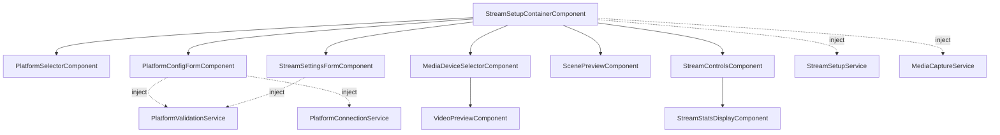
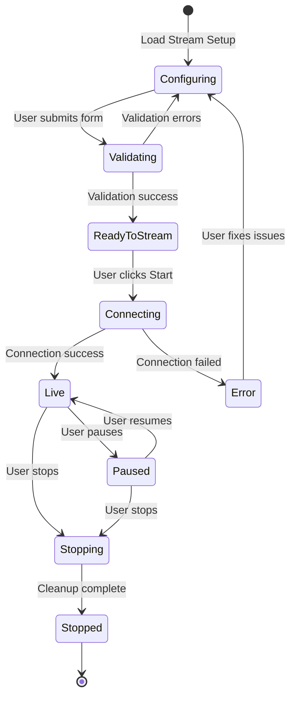
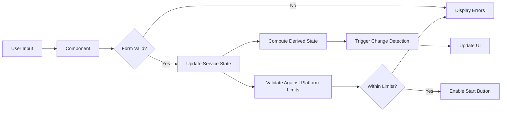

# Technical Specification: Stream Setup UI Feature Module (Issue #7)

**Project:** Stream Buddy
**Issue:** #7
**Author:** Angular Solutions Architect
**Date:** 2025-11-16
**Status:** Implementation Ready

---

## Table of Contents

1. [Feature Overview](#feature-overview)
2. [Research Summary](#research-summary)
3. [System Impact Analysis](#system-impact-analysis)
4. [Architecture Decisions](#architecture-decisions)
5. [Type Definitions](#type-definitions)
6. [API Integration](#api-integration)
7. [Accessibility & Web Standards](#accessibility--web-standards)
8. [Performance Considerations](#performance-considerations)
9. [Testing Strategy](#testing-strategy)
10. [Implementation Checklist](#implementation-checklist)

---

## 1. Feature Overview

### 1.1 Description

The Stream Setup UI is a comprehensive feature module that enables users to configure and manage multi-platform streaming sessions. This module provides a unified interface for selecting streaming platforms, configuring media sources, adjusting stream settings, managing scene compositions, and controlling active streams.

### 1.2 User-Facing Value Proposition

- **Multi-Platform Streaming**: Configure simultaneous streaming to Twitch, YouTube, Instagram, and TikTok from a single interface
- **Media Source Management**: Intuitive device selection and preview for cameras, microphones, and screen capture
- **Professional Stream Configuration**: Preset-based and custom quality settings with real-time validation
- **Live Stream Control**: Start, pause, and stop streams with real-time health monitoring and statistics
- **Responsive Design**: Desktop-first with full mobile functionality

### 1.3 Key Functional Requirements

1. **Platform Selection & Configuration**
   - Select and configure multiple streaming platforms
   - Platform-specific settings (stream key, RTMP URL, title, privacy)
   - Connection testing and validation
   - Multi-streaming capability

2. **Media Source Selection**
   - Device enumeration and selection (camera, microphone)
   - Screen capture configuration
   - Live preview integration
   - Permission management

3. **Stream Settings**
   - Quality presets (Low, Medium, High, Ultra, Custom)
   - Video configuration (resolution, frame rate, bitrate, codec)
   - Audio configuration (bitrate, sample rate, codec)
   - Platform-specific validation

4. **Scene Configuration**
   - Scene selection and preview
   - Basic source management
   - Scene composition display

5. **Stream Control**
   - Start/stop/pause streaming
   - Real-time health indicators
   - Live statistics (FPS, bitrate, dropped frames)
   - Error handling and recovery

---

## 2. Research Summary

### 2.1 Angular Signals & Reactive Forms (2025)

**Key Finding**: As of early 2025, Angular does not provide native signal-based reactive forms. The recommended approach is to use traditional ReactiveFormsModule and bridge form state to signals using `toSignal()` from `@angular/core/rxjs-interop`.

**Best Practices**:
- Use `toSignal()` to convert form `valueChanges` observables to signals
- Manage component state with signals while using reactive forms for validation
- Use `ChangeDetectionStrategy.OnPush` with signal-driven rendering
- Keep form validation logic in service layer when complex

**Source**: Angular Blog, Stack Overflow Angular community discussions (2025)

### 2.2 PrimeNG + Tailwind CSS Integration

**Key Finding**: PrimeNG 18+ introduced CSS variable tokenization, eliminating the need for global styles in angular.json. Each component is styled using base tokens and theme tokens, making it fully compatible with Tailwind CSS v4.

**Integration Strategy**:
- Use Tailwind for layout, spacing, typography, and utilities
- Leverage PrimeNG for interactive components (dropdowns, dialogs, buttons, etc.)
- Configure CSS layers to ensure Tailwind utilities can override PrimeNG styles
- Use PrimeNG's CSS layer after theme/base but before Tailwind utilities

**Required CSS Layer Order**:
```css
@layer primeng, tailwind-base, tailwind-components, tailwind-utilities;
```

**Source**: PrimeNG official documentation, Medium articles on Angular 19 + PrimeNG + Tailwind integration

### 2.3 State Management with Signals (2025)

**Key Finding**: For streaming applications, the recommended pattern is:
- **Local UI State**: Use Angular signals (`signal()`, `computed()`, `effect()`)
- **Server State**: Use TanStack Query or resource API (experimental in Angular 19)
- **Complex Event Streams**: Continue using RxJS for WebSocket, server-sent events, etc.
- **Shared Application State**: Use NgRx SignalStore for structured state management

**For This Feature**:
- Use signals for all local form state and UI state
- Bridge reactive forms to signals for validation state
- Use a dedicated service with signals for stream setup state
- Future: Migrate to server state library when streaming backend is implemented

**Source**: Nx Blog "Angular State Management for 2025", Medium articles on signals best practices

### 2.4 WCAG Accessibility for Forms & Streaming Controls (2025)

**Key Finding**: WCAG 2.2 Level AA is the target compliance level for most applications as of 2025. Specific requirements for this feature:

**Form Validation**:
- Use `role="alert"` and `aria-live="polite"` for error messages
- Ensure errors are identified in text, not just color (WCAG 1.4.1)
- Validate after user input, before form submission (WCAG 3.3.1)
- Provide clear, actionable error messages

**Streaming Controls**:
- All interactive elements must be keyboard accessible
- Provide visible focus indicators (WCAG 2.4.7)
- Use semantic HTML and ARIA roles for streaming status
- Ensure color contrast ratio of at least 4.5:1 for normal text (WCAG 1.4.3)
- Provide text alternatives for all status indicators

**Live Streaming Stats**:
- Use `aria-live="polite"` for statistics updates
- Avoid rapid updates that could be disorienting
- Provide pause mechanism for auto-updating content (WCAG 2.2.2)

**Source**: W3C WCAG 2.2 specification, WAI tutorials on accessible forms, Smashing Magazine accessibility guides

### 2.5 Research Conclusion

Based on this research, the Stream Setup UI will:
1. Use reactive forms bridged to signals for state management
2. Integrate PrimeNG components styled with Tailwind CSS
3. Implement signal-based local state with a dedicated service
4. Target WCAG 2.2 Level AA compliance
5. Use semantic HTML with proper ARIA attributes throughout

---

## 3. System Impact Analysis

### 3.1 Existing Services Used

**MediaCaptureService** (`/src/app/core/services/media-capture.service.ts`)
- **Impact**: Read-only consumption
- **Usage**: Device enumeration, camera/microphone/screen capture
- **Dependencies**: Signals for active streams, device lists

**VideoPreviewComponent** (`/src/app/shared/components/video-preview/video-preview.component.ts`)
- **Impact**: Integration as child component
- **Usage**: Real-time preview of selected media sources
- **Dependencies**: MediaStream input, stats display

### 3.2 New Services Required

**StreamSetupService** (new)
- **Purpose**: Manage stream setup state, form data, validation
- **Location**: `/src/app/features/stream-setup/services/stream-setup.service.ts`
- **State**: Platform configs, stream settings, selected devices, scene composition

**PlatformValidationService** (new)
- **Purpose**: Validate platform-specific constraints and settings
- **Location**: `/src/app/features/stream-setup/services/platform-validation.service.ts`
- **Logic**: Check bitrate limits, codec support, aspect ratio requirements

**PlatformConnectionService** (new - stub for future)
- **Purpose**: Test platform connections, validate credentials
- **Location**: `/src/app/features/stream-setup/services/platform-connection.service.ts`
- **Note**: Will return mock data until streaming backend is implemented

### 3.3 Existing Types Used

All types from `/src/app/core/models/`:
- `PlatformConfig`, `PlatformConfigMap`, `StreamingPlatform`, `PLATFORM_LIMITS`
- `StreamSettings`, `VideoEncoderSettings`, `AudioEncoderSettings`, `VIDEO_RESOLUTIONS`, `STREAM_QUALITY_PRESETS`
- `MediaSource`, `MediaSourceId`, `MediaDeviceInfo`
- `StreamingSession`, `StreamingStatus`, `StreamingStats`
- `SceneComposition`, `SceneSource`

### 3.4 Module Organization

**Feature Module Structure**: Standalone components only (per project standards)

```
/src/app/features/stream-setup/
├── components/
│   ├── stream-setup-container/          (Smart component)
│   ├── platform-selector/               (Presentational)
│   ├── platform-config-form/            (Presentational)
│   ├── media-device-selector/           (Presentational)
│   ├── stream-settings-form/            (Presentational)
│   ├── scene-preview/                   (Presentational)
│   ├── stream-controls/                 (Presentational)
│   └── stream-stats-display/            (Presentational)
├── services/
│   ├── stream-setup.service.ts
│   ├── platform-validation.service.ts
│   └── platform-connection.service.ts
└── stream-setup.routes.ts
```

### 3.5 Routing Configuration

**New Route**: `/stream-setup`

**Lazy Loading**: Yes, load entire feature on demand

**Route Configuration** (`/src/app/app.routes.ts`):
```typescript
{
  path: 'stream-setup',
  loadComponent: () =>
    import('./features/stream-setup/components/stream-setup-container/stream-setup-container.component')
      .then(m => m.StreamSetupContainerComponent),
  title: 'Stream Setup | Stream Buddy'
}
```

### 3.6 Breaking Changes

**None**. This is a new feature module with no impact on existing functionality.

### 3.7 Backward Compatibility

Not applicable (new feature).

---

## 4. Architecture Decisions

### 4.1 Component Architecture

#### Component Tree

```
<app-stream-setup-container>                    [Smart Component - Container]
├── <app-platform-selector>                    [Platform selection chips]
│   └── Platform Pills (PrimeNG Chips)
├── <app-platform-config-form>                 [Platform-specific settings form]
│   ├── Stream Key Input (PrimeNG Password)
│   ├── RTMP URL Input (PrimeNG InputText)
│   ├── Title Input (PrimeNG InputText)
│   └── Test Connection Button (PrimeNG Button)
├── <app-media-device-selector>                [Device dropdowns + preview]
│   ├── Camera Dropdown (PrimeNG Dropdown)
│   ├── Microphone Dropdown (PrimeNG Dropdown)
│   ├── Screen Share Button (PrimeNG Button)
│   └── <app-video-preview>                    [Existing component]
├── <app-stream-settings-form>                 [Quality settings form]
│   ├── Quality Preset Selector (PrimeNG Dropdown)
│   ├── Resolution Selector (PrimeNG Dropdown)
│   ├── Frame Rate Selector (PrimeNG Dropdown)
│   ├── Bitrate Slider (PrimeNG Slider)
│   └── Codec Selectors (PrimeNG Dropdown)
├── <app-scene-preview>                        [Scene composition preview]
│   └── Scene Canvas (Future: drag-drop)
└── <app-stream-controls>                      [Start/stop controls + stats]
    ├── Start Stream Button (PrimeNG Button)
    ├── Stop Stream Button (PrimeNG Button)
    ├── Pause Stream Button (PrimeNG Button)
    └── <app-stream-stats-display>             [Real-time stats]
```

#### Component Specifications

---

##### 1. StreamSetupContainerComponent

**Purpose**: Smart component orchestrating the entire stream setup flow

**Responsibility**:
- Manages overall stream setup state via StreamSetupService
- Handles form submission and validation
- Coordinates between child components
- Triggers media capture via MediaCaptureService

**Type Definitions**:
```typescript
// No inputs - root container
// No outputs - handles navigation internally

interface StreamSetupState {
  selectedPlatforms: Set<StreamingPlatform>;
  platformConfigs: PlatformConfigMap;
  streamSettings: StreamSettings;
  selectedDevices: SelectedDevices;
  currentScene: SceneComposition | null;
  isStreaming: boolean;
  streamSession: StreamingSession | null;
}

interface SelectedDevices {
  camera: MediaDeviceInfo | null;
  microphone: MediaDeviceInfo | null;
  screen: MediaSource | null;
}
```

**Change Detection**: `ChangeDetectionStrategy.OnPush`

**Template Strategy**: External template file (complex layout)

**State Management**:
- Inject `StreamSetupService` for shared state
- Inject `MediaCaptureService` for device access
- Use signals for all local UI state
- Bridge reactive form state to signals using `toSignal()`

**Dependencies**:
- `ReactiveFormsModule` (imported directly in component)
- PrimeNG components (imported as needed)

---

##### 2. PlatformSelectorComponent

**Purpose**: Multi-select platform chip selector

**Responsibility**: Display available platforms as selectable chips

**Input/Output Contract**:
```typescript
interface PlatformSelectorInputs {
  selectedPlatforms: ReadonlySet<StreamingPlatform>;
  availablePlatforms: readonly StreamingPlatform[];
  disabled: boolean;
}

interface PlatformSelectorOutputs {
  platformToggled: StreamingPlatform;  // Emits platform when toggled
}
```

**Change Detection**: `ChangeDetectionStrategy.OnPush`

**Template Strategy**: Inline template (< 50 lines)

**Implementation Notes**:
- Use PrimeNG `SelectButton` for multi-select
- Display platform icons/logos
- Show validation errors for platform limits (e.g., "Instagram requires vertical aspect ratio")

---

##### 3. PlatformConfigFormComponent

**Purpose**: Dynamic form for configuring selected platform

**Responsibility**: Render platform-specific configuration fields

**Input/Output Contract**:
```typescript
interface PlatformConfigFormInputs {
  platform: StreamingPlatform;
  config: PlatformConfig | null;
  validationErrors: readonly ValidationError[];
}

interface PlatformConfigFormOutputs {
  configChanged: PlatformConfig;
  testConnection: StreamingPlatform;
}

interface ValidationError {
  field: string;
  message: string;
}
```

**Change Detection**: `ChangeDetectionStrategy.OnPush`

**Template Strategy**: External template file (dynamic fields)

**Form Implementation**:
- Use `ReactiveFormsModule` with `FormGroup`
- Bridge form `valueChanges` to signal using `toSignal()`
- Implement custom validators for stream key, RTMP URL
- Use PrimeNG `Password` component for stream key (masked input)

**Platform-Specific Fields**:
- **Twitch**: Ingest server, stream key, title, category
- **YouTube**: Broadcast ID, stream key, title, description, privacy
- **Instagram**: Stream key, RTMP URL (vertical aspect ratio warning)
- **TikTok**: Stream key (unsupported warning)

---

##### 4. MediaDeviceSelectorComponent

**Purpose**: Device selection dropdowns with live preview

**Responsibility**: Enumerate and select camera/microphone, trigger screen capture

**Input/Output Contract**:
```typescript
interface MediaDeviceSelectorInputs {
  availableDevices: readonly MediaDeviceInfo[];
  selectedCamera: MediaDeviceInfo | null;
  selectedMicrophone: MediaDeviceInfo | null;
  previewStream: MediaStream | null;
  disabled: boolean;
}

interface MediaDeviceSelectorOutputs {
  cameraSelected: string;  // deviceId
  microphoneSelected: string;  // deviceId
  screenCaptureRequested: void;
  previewToggled: boolean;
}
```

**Change Detection**: `ChangeDetectionStrategy.OnPush`

**Template Strategy**: External template file (includes preview)

**Implementation Notes**:
- Use PrimeNG `Dropdown` for device selection
- Integrate `VideoPreviewComponent` for camera preview
- Request permissions on device selection
- Display permission errors inline with `role="alert"`

---

##### 5. StreamSettingsFormComponent

**Purpose**: Stream quality and encoding settings form

**Responsibility**: Configure video/audio encoder settings with preset support

**Input/Output Contract**:
```typescript
interface StreamSettingsFormInputs {
  currentSettings: StreamSettings;
  platformLimits: PlatformLimits[];  // Combined limits from selected platforms
  selectedPreset: StreamQualityPreset;
}

interface StreamSettingsFormOutputs {
  settingsChanged: StreamSettings;
  presetSelected: StreamQualityPreset;
}
```

**Change Detection**: `ChangeDetectionStrategy.OnPush`

**Template Strategy**: External template file (complex form)

**Form Implementation**:
- Use `ReactiveFormsModule` with nested `FormGroup`
- Preset selector updates all fields automatically
- Validate against platform limits (computed signal)
- Use PrimeNG `Slider` for bitrate
- Use PrimeNG `Dropdown` for resolution, frame rate, codecs

**Validation Logic**:
```typescript
// Computed signal for effective limits
effectiveLimits = computed(() => {
  const platforms = this.selectedPlatforms();
  const limits = platforms.map(p => PLATFORM_LIMITS[p]);
  return {
    maxVideoBitrate: Math.min(...limits.map(l => l.maxVideoBitrate)),
    maxAudioBitrate: Math.min(...limits.map(l => l.maxAudioBitrate)),
    supportedVideoCodecs: intersection(...limits.map(l => l.supportedVideoCodecs)),
    supportedAudioCodecs: intersection(...limits.map(l => l.supportedAudioCodecs)),
    requiredAspectRatio: /* check if all platforms require same */ null || number
  };
});
```

---

##### 6. ScenePreviewComponent

**Purpose**: Display current scene composition

**Responsibility**: Show canvas-based scene preview with sources

**Input/Output Contract**:
```typescript
interface ScenePreviewInputs {
  scene: SceneComposition | null;
  mediaSources: readonly MediaSource[];
}

interface ScenePreviewOutputs {
  sceneEditRequested: SceneId;
}
```

**Change Detection**: `ChangeDetectionStrategy.OnPush`

**Template Strategy**: External template file (canvas rendering)

**Implementation Notes**:
- Render scene on `<canvas>` element
- Display placeholder if no scene selected
- Use `effect()` to redraw canvas when scene or sources change
- Future: Add drag-drop for source repositioning

---

##### 7. StreamControlsComponent

**Purpose**: Start, stop, pause controls with connection status

**Responsibility**: Control stream lifecycle and display connection state

**Input/Output Contract**:
```typescript
interface StreamControlsInputs {
  streamingStatus: StreamingStatus;
  canStartStream: boolean;  // All required fields configured
  platformStatuses: readonly PlatformStreamStatus[];
}

interface StreamControlsOutputs {
  startStream: void;
  stopStream: void;
  pauseStream: void;
}

interface PlatformStreamStatus {
  platform: StreamingPlatform;
  status: StreamingStatus;
  error: string | null;
}
```

**Change Detection**: `ChangeDetectionStrategy.OnPush`

**Template Strategy**: Inline template (< 50 lines)

**Implementation Notes**:
- Use PrimeNG `Button` with loading state
- Disable buttons based on streaming status
- Display platform-specific connection status with icons
- Use color coding for status (green = live, yellow = connecting, red = error)

---

##### 8. StreamStatsDisplayComponent

**Purpose**: Real-time streaming statistics

**Responsibility**: Display FPS, bitrate, dropped frames, CPU usage

**Input/Output Contract**:
```typescript
interface StreamStatsDisplayInputs {
  stats: StreamingStats | null;
  updateInterval: number;  // ms, default 1000
}

// No outputs - display only
```

**Change Detection**: `ChangeDetectionStrategy.OnPush`

**Template Strategy**: Inline template (< 50 lines)

**Implementation Notes**:
- Use `aria-live="polite"` for screen reader updates
- Format numbers with locale-aware formatting
- Use color coding for health indicators (e.g., dropped frames > 5% = red)
- Update at configurable interval to avoid performance issues

---

### 4.2 State Management Strategy

#### Service: StreamSetupService

**Purpose**: Centralized signal-based state management for stream setup

**State Shape**:
```typescript
interface StreamSetupServiceState {
  // Platform configuration
  selectedPlatforms: Set<StreamingPlatform>;
  platformConfigs: PlatformConfigMap;

  // Media devices
  availableDevices: readonly MediaDeviceInfo[];
  selectedCamera: MediaDeviceInfo | null;
  selectedMicrophone: MediaDeviceInfo | null;
  screenSource: MediaSource | null;

  // Stream settings
  qualityPreset: StreamQualityPreset;
  streamSettings: StreamSettings;

  // Scene
  currentScene: SceneComposition | null;

  // Streaming session
  streamingStatus: StreamingStatus;
  streamSession: StreamingSession | null;

  // UI state
  validationErrors: readonly ValidationError[];
  isSaving: boolean;
}
```

**Signal Implementation**:
```typescript
@Injectable({ providedIn: 'root' })
export class StreamSetupService {
  // Private writable signals
  private readonly _selectedPlatforms = signal<Set<StreamingPlatform>>(new Set());
  private readonly _platformConfigs = signal<PlatformConfigMap>({});
  private readonly _availableDevices = signal<readonly MediaDeviceInfo[]>([]);
  private readonly _selectedCamera = signal<MediaDeviceInfo | null>(null);
  private readonly _selectedMicrophone = signal<MediaDeviceInfo | null>(null);
  private readonly _screenSource = signal<MediaSource | null>(null);
  private readonly _qualityPreset = signal<StreamQualityPreset>('medium');
  private readonly _streamSettings = signal<StreamSettings>(STREAM_QUALITY_PRESETS.medium!);
  private readonly _currentScene = signal<SceneComposition | null>(null);
  private readonly _streamingStatus = signal<StreamingStatus>('stopped');
  private readonly _streamSession = signal<StreamingSession | null>(null);
  private readonly _validationErrors = signal<readonly ValidationError[]>([]);
  private readonly _isSaving = signal<boolean>(false);

  // Public read-only signals
  readonly selectedPlatforms = this._selectedPlatforms.asReadonly();
  readonly platformConfigs = this._platformConfigs.asReadonly();
  readonly availableDevices = this._availableDevices.asReadonly();
  readonly selectedCamera = this._selectedCamera.asReadonly();
  readonly selectedMicrophone = this._selectedMicrophone.asReadonly();
  readonly screenSource = this._screenSource.asReadonly();
  readonly qualityPreset = this._qualityPreset.asReadonly();
  readonly streamSettings = this._streamSettings.asReadonly();
  readonly currentScene = this._currentScene.asReadonly();
  readonly streamingStatus = this._streamingStatus.asReadonly();
  readonly streamSession = this._streamSession.asReadonly();
  readonly validationErrors = this._validationErrors.asReadonly();
  readonly isSaving = this._isSaving.asReadonly();

  // Computed signals
  readonly hasSelectedPlatforms = computed(() => this._selectedPlatforms().size > 0);

  readonly effectivePlatformLimits = computed(() => {
    const platforms = Array.from(this._selectedPlatforms());
    if (platforms.length === 0) return null;

    const limits = platforms.map(p => PLATFORM_LIMITS[p]);
    return {
      maxVideoBitrate: Math.min(...limits.map(l => l.maxVideoBitrate)),
      maxAudioBitrate: Math.min(...limits.map(l => l.maxAudioBitrate)),
      supportedVideoCodecs: this.intersectCodecs(limits.map(l => l.supportedVideoCodecs)),
      supportedAudioCodecs: this.intersectCodecs(limits.map(l => l.supportedAudioCodecs)),
    };
  });

  readonly canStartStream = computed(() => {
    return (
      this.hasSelectedPlatforms() &&
      this._selectedCamera() !== null &&
      this._selectedMicrophone() !== null &&
      this._streamingStatus() === 'stopped' &&
      this._validationErrors().length === 0
    );
  });

  readonly previewStream = computed(() => {
    const camera = this._selectedCamera();
    const mediaCaptureService = inject(MediaCaptureService);
    const sources = mediaCaptureService.activeCameraSources();

    // Find active camera stream matching selected device
    if (camera) {
      const activeSource = sources.find(s => {
        const tracks = s.stream.getVideoTracks();
        return tracks.some(t => t.getSettings().deviceId === camera.deviceId);
      });
      return activeSource?.stream ?? null;
    }

    return null;
  });

  // Methods
  togglePlatform(platform: StreamingPlatform): void { /* ... */ }
  updatePlatformConfig(platform: StreamingPlatform, config: PlatformConfig): void { /* ... */ }
  setQualityPreset(preset: StreamQualityPreset): void { /* ... */ }
  updateStreamSettings(settings: Partial<StreamSettings>): void { /* ... */ }
  selectCamera(deviceId: string): Promise<void> { /* ... */ }
  selectMicrophone(deviceId: string): Promise<void> { /* ... */ }
  startScreenCapture(): Promise<void> { /* ... */ }
  startStreaming(): Promise<void> { /* ... */ }
  stopStreaming(): Promise<void> { /* ... */ }
  pauseStreaming(): Promise<void> { /* ... */ }

  private intersectCodecs(codecArrays: readonly string[][]): readonly string[] { /* ... */ }
}
```

**Rationale**:
- Signals provide fine-grained reactivity for UI updates
- Computed signals automatically derive validation state
- Centralized service ensures single source of truth
- Read-only public signals prevent accidental mutations
- Methods provide controlled state updates with validation

---

#### Service: PlatformValidationService

**Purpose**: Validate platform-specific constraints

**Method Signatures**:
```typescript
@Injectable({ providedIn: 'root' })
export class PlatformValidationService {
  /**
   * Validate stream settings against platform limits
   */
  validateStreamSettings(
    settings: StreamSettings,
    platforms: readonly StreamingPlatform[]
  ): ValidationResult;

  /**
   * Validate platform configuration
   */
  validatePlatformConfig(config: PlatformConfig): ValidationResult;

  /**
   * Check if aspect ratio matches platform requirements
   */
  validateAspectRatio(
    resolution: VideoResolution,
    platform: StreamingPlatform
  ): ValidationResult;

  /**
   * Get effective limits when streaming to multiple platforms
   */
  getEffectiveLimits(platforms: readonly StreamingPlatform[]): PlatformLimits;
}

interface ValidationResult {
  valid: boolean;
  errors: readonly ValidationError[];
  warnings: readonly ValidationWarning[];
}

interface ValidationError {
  field: string;
  message: string;
  code: string;
}

interface ValidationWarning {
  field: string;
  message: string;
  suggestion: string;
}
```

---

#### Service: PlatformConnectionService

**Purpose**: Test platform connections (stub for future backend)

**Method Signatures**:
```typescript
@Injectable({ providedIn: 'root' })
export class PlatformConnectionService {
  /**
   * Test connection to platform RTMP endpoint
   * Currently returns mock data - will integrate with backend
   */
  testConnection(
    platform: StreamingPlatform,
    config: PlatformConfig
  ): Promise<ConnectionTestResult>;

  /**
   * Validate stream key format (client-side only)
   */
  validateStreamKey(
    platform: StreamingPlatform,
    streamKey: StreamKey
  ): ValidationResult;
}

interface ConnectionTestResult {
  success: boolean;
  latency: number | null;  // ms
  error: string | null;
  timestamp: Date;
}
```

**Note**: This service will return mock success/failure responses until the streaming backend is implemented. This allows UI development to proceed independently.

---

### 4.3 Reactive Forms Bridge Pattern

**Pattern**: Bridge reactive forms to signals for validation state

**Example Implementation** (StreamSettingsFormComponent):

```typescript
export class StreamSettingsFormComponent {
  private readonly fb = inject(FormBuilder);

  // Reactive form
  readonly settingsForm = this.fb.group({
    video: this.fb.group({
      codec: ['h264' as VideoCodec, Validators.required],
      resolution: [VIDEO_RESOLUTIONS['1080p'], Validators.required],
      frameRate: [30 as FrameRate, Validators.required],
      bitrate: [6000, [Validators.required, Validators.min(500)]],
      keyframeInterval: [2, Validators.required],
      hardwareAcceleration: [true],
      profile: ['high' as const]
    }),
    audio: this.fb.group({
      codec: ['aac' as AudioCodec, Validators.required],
      bitrate: [160, [Validators.required, Validators.min(64)]],
      sampleRate: [48000, Validators.required],
      channels: [2 as const, Validators.required]
    }),
    lowLatencyMode: [false]
  });

  // Bridge form state to signals
  private readonly formValue = toSignal(
    this.settingsForm.valueChanges,
    { initialValue: this.settingsForm.value }
  );

  private readonly formValid = toSignal(
    this.settingsForm.statusChanges.pipe(map(status => status === 'VALID')),
    { initialValue: false }
  );

  // Computed validation messages
  readonly validationErrors = computed(() => {
    if (this.formValid()) return [];

    const errors: ValidationError[] = [];
    const controls = this.settingsForm.controls;

    // Video validation
    if (controls.video.errors) {
      errors.push({ field: 'video', message: 'Video settings invalid' });
    }

    // Audio validation
    if (controls.audio.errors) {
      errors.push({ field: 'audio', message: 'Audio settings invalid' });
    }

    return errors;
  });

  // Output when form is valid
  readonly settingsChanged = output<StreamSettings>();

  constructor() {
    // Emit settings when form is valid and changes
    effect(() => {
      if (this.formValid()) {
        const value = this.formValue();
        if (value) {
          this.settingsChanged.emit(value as StreamSettings);
        }
      }
    });
  }
}
```

**Rationale**:
- Reactive forms provide robust validation infrastructure
- Signals provide efficient reactivity for UI rendering
- `toSignal()` creates a one-way bridge from Observable to Signal
- `effect()` emits output events when form state changes
- Computed signals derive validation messages from form state

---

## 5. Type Definitions

### 5.1 Component Input/Output Types

All component input/output types are defined in [Section 4.1](#component-specifications).

### 5.2 Service State Types

```typescript
/**
 * Stream setup service state
 */
export interface StreamSetupServiceState {
  readonly selectedPlatforms: ReadonlySet<StreamingPlatform>;
  readonly platformConfigs: PlatformConfigMap;
  readonly availableDevices: readonly MediaDeviceInfo[];
  readonly selectedCamera: MediaDeviceInfo | null;
  readonly selectedMicrophone: MediaDeviceInfo | null;
  readonly screenSource: MediaSource | null;
  readonly qualityPreset: StreamQualityPreset;
  readonly streamSettings: StreamSettings;
  readonly currentScene: SceneComposition | null;
  readonly streamingStatus: StreamingStatus;
  readonly streamSession: StreamingSession | null;
  readonly validationErrors: readonly ValidationError[];
  readonly isSaving: boolean;
}

/**
 * Selected devices for stream
 */
export interface SelectedDevices {
  readonly camera: MediaDeviceInfo | null;
  readonly microphone: MediaDeviceInfo | null;
  readonly screen: MediaSource | null;
}
```

### 5.3 Validation Types

```typescript
/**
 * Validation result
 */
export interface ValidationResult {
  readonly valid: boolean;
  readonly errors: readonly ValidationError[];
  readonly warnings: readonly ValidationWarning[];
}

/**
 * Validation error
 */
export interface ValidationError {
  readonly field: string;
  readonly message: string;
  readonly code: string;
}

/**
 * Validation warning (non-blocking)
 */
export interface ValidationWarning {
  readonly field: string;
  readonly message: string;
  readonly suggestion: string;
}
```

### 5.4 Platform Connection Types

```typescript
/**
 * Connection test result
 */
export interface ConnectionTestResult {
  readonly success: boolean;
  readonly latency: number | null;  // milliseconds
  readonly error: string | null;
  readonly timestamp: Date;
}

/**
 * Platform stream status (for multi-platform)
 */
export interface PlatformStreamStatus {
  readonly platform: StreamingPlatform;
  readonly status: StreamingStatus;
  readonly error: string | null;
  readonly startedAt: Date | null;
}
```

### 5.5 Form Value Types

```typescript
/**
 * Stream settings form value (compatible with FormGroup)
 */
export interface StreamSettingsFormValue {
  readonly video: {
    readonly codec: VideoCodec;
    readonly resolution: VideoResolution;
    readonly frameRate: FrameRate;
    readonly bitrate: number;
    readonly keyframeInterval: number;
    readonly hardwareAcceleration: boolean;
    readonly profile?: 'baseline' | 'main' | 'high';
  };
  readonly audio: {
    readonly codec: AudioCodec;
    readonly bitrate: number;
    readonly sampleRate: number;
    readonly channels: 1 | 2;
  };
  readonly lowLatencyMode: boolean;
}

/**
 * Platform config form value (varies by platform)
 */
export type PlatformConfigFormValue =
  | TwitchConfigFormValue
  | YouTubeConfigFormValue
  | InstagramConfigFormValue
  | TikTokConfigFormValue;

export interface TwitchConfigFormValue {
  readonly platform: 'twitch';
  readonly enabled: boolean;
  readonly rtmpUrl: string;
  readonly streamKey: string;
  readonly ingestServer: string;
  readonly title?: string;
  readonly categoryId?: string;
}

export interface YouTubeConfigFormValue {
  readonly platform: 'youtube';
  readonly enabled: boolean;
  readonly rtmpUrl: string;
  readonly streamKey: string;
  readonly broadcastId: string;
  readonly title?: string;
  readonly description?: string;
  readonly privacyStatus: 'public' | 'unlisted' | 'private';
}

export interface InstagramConfigFormValue {
  readonly platform: 'instagram';
  readonly enabled: boolean;
  readonly rtmpUrl: string;
  readonly streamKey: string;
  readonly aspectRatio: 0.5625;
  readonly isProfessionalAccount: boolean;
}

export interface TikTokConfigFormValue {
  readonly platform: 'tiktok';
  readonly enabled: boolean;
  readonly rtmpUrl: string;
  readonly streamKey: string;
  readonly warning: string;
  readonly minimumFollowers: number;
}
```

---

## 6. API Integration

### 6.1 Backend Endpoints (Future Implementation)

**Note**: The Stream Setup UI will initially operate without a backend. All API methods will return mock data or throw "not implemented" errors. This section defines the contract for future backend integration.

#### 6.1.1 Platform Connection Testing

```typescript
/**
 * Test RTMP connection to platform
 * POST /api/platform/test-connection
 */
interface TestConnectionRequest {
  platform: StreamingPlatform;
  rtmpUrl: RtmpUrl;
  streamKey: StreamKey;
}

interface TestConnectionResponse {
  success: boolean;
  latency: number | null;  // ms
  errorCode: string | null;
  errorMessage: string | null;
  timestamp: string;  // ISO 8601
}
```

#### 6.1.2 Stream Session Management

```typescript
/**
 * Start streaming session
 * POST /api/stream/start
 */
interface StartStreamRequest {
  platforms: readonly PlatformConfig[];
  streamSettings: StreamSettings;
  sceneId: SceneId | null;
}

interface StartStreamResponse {
  sessionId: SessionId;
  status: StreamingStatus;
  platformStatuses: readonly {
    platform: StreamingPlatform;
    status: StreamingStatus;
    error: string | null;
  }[];
}

/**
 * Stop streaming session
 * POST /api/stream/stop
 */
interface StopStreamRequest {
  sessionId: SessionId;
}

interface StopStreamResponse {
  sessionId: SessionId;
  status: StreamingStatus;
  endedAt: string;  // ISO 8601
}

/**
 * Get streaming statistics (Server-Sent Events or WebSocket)
 * GET /api/stream/stats/:sessionId
 */
interface StreamStatsEvent {
  sessionId: SessionId;
  stats: StreamingStats;
  platformStats: readonly {
    platform: StreamingPlatform;
    videoBitrate: number;
    audioBitrate: number;
  }[];
}
```

### 6.2 Error Handling Strategy

**HTTP Error Codes**:
- `400 Bad Request`: Invalid platform configuration or stream settings
- `401 Unauthorized`: Invalid stream key or authentication failure
- `403 Forbidden`: Platform rejected connection (e.g., stream key revoked)
- `503 Service Unavailable`: Platform RTMP server unreachable
- `500 Internal Server Error`: Unexpected server error

**Error Response Format**:
```typescript
interface ApiErrorResponse {
  error: {
    code: string;
    message: string;
    details?: Record<string, unknown>;
    suggestedAction?: string;
  };
}
```

**Client-Side Error Handling**:
```typescript
// In PlatformConnectionService
async testConnection(platform: StreamingPlatform, config: PlatformConfig): Promise<ConnectionTestResult> {
  try {
    const response = await fetch('/api/platform/test-connection', {
      method: 'POST',
      headers: { 'Content-Type': 'application/json' },
      body: JSON.stringify({ platform, rtmpUrl: config.rtmpUrl, streamKey: config.streamKey })
    });

    if (!response.ok) {
      const errorData: ApiErrorResponse = await response.json();
      return {
        success: false,
        latency: null,
        error: errorData.error.message,
        timestamp: new Date()
      };
    }

    const data: TestConnectionResponse = await response.json();
    return {
      success: data.success,
      latency: data.latency,
      error: data.errorMessage,
      timestamp: new Date(data.timestamp)
    };
  } catch (error) {
    return {
      success: false,
      latency: null,
      error: 'Network error - unable to reach server',
      timestamp: new Date()
    };
  }
}
```

### 6.3 HTTP Interceptors

**Not required initially**. When backend is implemented, consider:

- **AuthInterceptor**: Add authentication tokens to requests
- **ErrorInterceptor**: Global error handling and logging
- **RetryInterceptor**: Retry failed requests with exponential backoff

### 6.4 Guards

**Not required initially**. Future considerations:

- **StreamingActiveGuard**: Prevent navigation away from stream setup while streaming is active
- **UnsavedChangesGuard**: Warn user about unsaved platform configurations

---

## 7. Accessibility & Web Standards

### 7.1 WCAG 2.2 Level AA Compliance

**Target**: Full WCAG 2.2 Level AA compliance

### 7.2 Form Accessibility

#### 7.2.1 Error Identification (WCAG 3.3.1)

**Requirement**: If an input error is automatically detected, the item that is in error is identified and the error is described to the user in text.

**Implementation**:
```html
<!-- Platform config form example -->
<div class="form-field">
  <label for="stream-key">Stream Key</label>
  <p-password
    id="stream-key"
    formControlName="streamKey"
    [feedback]="false"
    [attr.aria-invalid]="streamKeyInvalid()"
    [attr.aria-describedby]="streamKeyInvalid() ? 'stream-key-error' : null">
  </p-password>

  @if (streamKeyInvalid()) {
    <div
      id="stream-key-error"
      class="error-message"
      role="alert"
      aria-live="polite">
      {{ streamKeyError() }}
    </div>
  }
</div>
```

**CSS Requirements**:
- Error messages must not rely on color alone (WCAG 1.4.1)
- Use icon + text + red border for errors
- Ensure 4.5:1 contrast ratio for error text

#### 7.2.2 Labels and Instructions (WCAG 3.3.2)

**Requirement**: Labels or instructions are provided when content requires user input.

**Implementation**:
- All form inputs must have associated `<label>` elements
- Use `aria-describedby` for additional instructions
- Provide inline help text for complex fields (e.g., RTMP URL format)

```html
<div class="form-field">
  <label for="rtmp-url">RTMP Ingest URL</label>
  <p class="help-text" id="rtmp-url-help">
    Format: rtmp://live.platform.com/app
  </p>
  <p-input-text
    id="rtmp-url"
    formControlName="rtmpUrl"
    aria-describedby="rtmp-url-help">
  </p-input-text>
</div>
```

#### 7.2.3 Error Prevention (WCAG 3.3.4)

**Requirement**: For forms that cause legal commitments or financial transactions, at least one of: reversible, checked, confirmed.

**Implementation**:
- Show confirmation dialog before starting stream
- Display summary of all settings before starting
- Allow user to review and edit configuration

```typescript
async startStreaming(): Promise<void> {
  const confirmed = await this.confirmationDialog.show({
    title: 'Start Streaming?',
    message: `You are about to start streaming to ${this.selectedPlatforms().size} platform(s).`,
    details: this.getStreamSummary(),
    confirmLabel: 'Start Stream',
    cancelLabel: 'Cancel'
  });

  if (confirmed) {
    // Start streaming
  }
}
```

### 7.3 Keyboard Accessibility

#### 7.3.1 Keyboard Navigation (WCAG 2.1.1)

**Requirement**: All functionality available via keyboard

**Implementation**:
- All interactive elements must be focusable (`tabindex="0"` or native focusable elements)
- Logical tab order following visual layout
- No keyboard traps

**Custom Tab Order** (if needed):
```html
<div class="platform-selector">
  <button tabindex="0">Twitch</button>
  <button tabindex="0">YouTube</button>
  <button tabindex="0">Instagram</button>
</div>
```

#### 7.3.2 Focus Visible (WCAG 2.4.7)

**Requirement**: Keyboard focus indicator is visible

**Implementation**:
```css
/* Global focus styles (in styles.scss) */
:focus-visible {
  outline: 2px solid var(--focus-color);
  outline-offset: 2px;
}

/* High contrast mode support */
@media (prefers-contrast: high) {
  :focus-visible {
    outline-width: 3px;
  }
}
```

#### 7.3.3 Keyboard Shortcuts (Custom)

**Stream Controls Shortcuts**:
- `Ctrl+Enter` / `Cmd+Enter`: Start stream
- `Ctrl+Shift+S` / `Cmd+Shift+S`: Stop stream
- `Ctrl+P` / `Cmd+P`: Pause stream
- `Escape`: Close dialogs

**Implementation**:
```typescript
@HostListener('document:keydown', ['$event'])
handleGlobalKeydown(event: KeyboardEvent): void {
  if ((event.ctrlKey || event.metaKey) && event.key === 'Enter') {
    event.preventDefault();
    if (this.canStartStream()) {
      this.startStreaming();
    }
  }
}
```

**Note**: Provide keyboard shortcut reference in help dialog

### 7.4 ARIA Roles and Properties

#### 7.4.1 Live Regions (WCAG 4.1.3)

**Requirement**: Status messages can be programmatically determined through role or properties

**Implementation**:

**Stream Status Updates**:
```html
<div
  role="status"
  aria-live="polite"
  aria-atomic="true"
  class="stream-status">
  {{ streamingStatus() === 'live' ? 'Stream is live' : 'Stream is not active' }}
</div>
```

**Statistics Updates**:
```html
<div
  role="region"
  aria-label="Stream statistics"
  class="stats-display">
  <div aria-live="polite" aria-atomic="false">
    <span>FPS: {{ stats()?.fps }}</span>
  </div>
</div>
```

**Rationale**:
- `aria-live="polite"`: Announces changes without interrupting user
- `aria-atomic="true"`: Reads entire region on update (for status messages)
- `aria-atomic="false"`: Reads only changed elements (for statistics)

#### 7.4.2 Form Validation Announcements

```html
<div
  role="alert"
  aria-live="assertive"
  @if (validationErrors().length > 0)>
  <p>{{ validationErrors().length }} error(s) found. Please correct them before continuing.</p>
  <ul>
    @for (error of validationErrors(); track error.field) {
      <li>{{ error.message }}</li>
    }
  </ul>
</div>
```

**Rationale**: `role="alert"` + `aria-live="assertive"` ensures errors are announced immediately

### 7.5 Color Contrast (WCAG 1.4.3)

**Requirement**: 4.5:1 contrast ratio for normal text, 3:1 for large text

**Implementation**:
- Use Tailwind CSS utilities with guaranteed contrast
- Test all custom colors with contrast checker
- Provide high contrast mode support

**High Contrast Mode**:
```css
@media (prefers-contrast: high) {
  .stream-status.live {
    background-color: #000;
    color: #fff;
    border: 2px solid #fff;
  }

  .error-message {
    background-color: #fff;
    color: #000;
    border: 2px solid #f00;
  }
}
```

### 7.6 Semantic HTML

**Requirement**: Use semantic HTML elements for proper structure

**Implementation**:
- Use `<main>` for main content area
- Use `<form>` for all forms (with `novalidate` for custom validation)
- Use `<button type="button">` for actions, `<button type="submit">` for form submission
- Use `<fieldset>` and `<legend>` for grouped form controls

**Example**:
```html
<main id="stream-setup" role="main" aria-labelledby="page-title">
  <h1 id="page-title">Stream Setup</h1>

  <section aria-labelledby="platform-section">
    <h2 id="platform-section">Platform Selection</h2>
    <app-platform-selector />
  </section>

  <form (ngSubmit)="handleSubmit()" novalidate>
    <fieldset>
      <legend>Platform Configuration</legend>
      <app-platform-config-form />
    </fieldset>

    <fieldset>
      <legend>Media Devices</legend>
      <app-media-device-selector />
    </fieldset>

    <button type="submit" [disabled]="!canStartStream()">
      Start Stream
    </button>
  </form>
</main>
```

### 7.7 Accessible Names (WCAG 4.1.2)

**Requirement**: All user interface components have accessible names

**Implementation**:
- All buttons have `aria-label` or visible text
- All form inputs have associated labels
- Icon-only buttons have `aria-label`

```html
<button
  type="button"
  class="icon-btn"
  aria-label="Test connection to Twitch"
  (click)="testConnection('twitch')">
  <i class="pi pi-check" aria-hidden="true"></i>
</button>
```

### 7.8 Accessibility Testing Requirements

**Manual Testing**:
- Test all functionality with keyboard only
- Test with screen reader (NVDA on Windows, VoiceOver on macOS)
- Test with high contrast mode enabled
- Test with browser zoom at 200%

**Automated Testing**:
- Run axe-core accessibility checks in unit tests
- Use Lighthouse accessibility audit in CI/CD pipeline

**Accessibility Test Cases** (in Testing Strategy section):
- Keyboard navigation through all form fields
- Screen reader announces all error messages
- Focus indicators visible on all interactive elements
- All buttons have accessible names

---

## 8. Performance Considerations

### 8.1 Lazy Loading Strategy

**Feature Module Lazy Loading**:
```typescript
// app.routes.ts
{
  path: 'stream-setup',
  loadComponent: () =>
    import('./features/stream-setup/components/stream-setup-container/stream-setup-container.component')
      .then(m => m.StreamSetupContainerComponent),
}
```

**Rationale**:
- Stream Setup UI is a secondary route, not needed on initial load
- Reduces initial bundle size by ~50-80 KB (estimated)

**PrimeNG Component Lazy Loading**:
- Import PrimeNG components only in the components that use them
- Avoid importing entire PrimeNG module

```typescript
// Correct
import { Dropdown } from 'primeng/dropdown';
import { Button } from 'primeng/button';

// Incorrect
import { PrimeNGModule } from 'primeng/primeng';  // DON'T DO THIS
```

### 8.2 Change Detection Optimization

**OnPush Strategy**:
- All components use `ChangeDetectionStrategy.OnPush`
- Update components only when inputs change or events fire
- Use signals for reactive state (auto-triggers change detection)

**Rationale**:
- Reduces unnecessary change detection cycles
- Signals automatically mark components as dirty when updated
- PrimeNG components compatible with OnPush

**Example**:
```typescript
@Component({
  selector: 'app-stream-stats-display',
  changeDetection: ChangeDetectionStrategy.OnPush,
  // ...
})
export class StreamStatsDisplayComponent {
  readonly stats = input.required<StreamingStats | null>();

  // Computed signals trigger change detection automatically
  readonly formattedFps = computed(() => {
    const s = this.stats();
    return s ? `${s.fps.toFixed(1)} FPS` : 'N/A';
  });
}
```

### 8.3 Image Optimization

**Not applicable** - No static images used in this feature.

If adding platform logos in future:
- Use `NgOptimizedImage` directive
- Provide `width` and `height` attributes
- Use `priority` for above-the-fold images

### 8.4 Bundle Size Impact Assessment

**Estimated Additions**:
- Feature components: ~30 KB (minified + gzipped)
- PrimeNG components used: ~60 KB (Dropdown, Button, Slider, InputText, Password, SelectButton)
- Service logic: ~10 KB
- **Total**: ~100 KB added to lazy-loaded chunk

**Mitigation**:
- All code is lazy-loaded (not in main bundle)
- PrimeNG components tree-shakeable
- No large dependencies added

### 8.5 Virtual Scrolling

**Not required** for this feature. Device lists are typically < 20 items.

If device lists grow large in future, use PrimeNG `VirtualScroller`:
```html
<p-virtualScroller
  [value]="devices()"
  [itemSize]="50"
  scrollHeight="300px">
  <ng-template pTemplate="item" let-device>
    <div>{{ device.label }}</div>
  </ng-template>
</p-virtualScroller>
```

### 8.6 Signal Update Batching

**Automatic in Angular 19**: Signal updates are batched automatically within the same execution context.

**Manual Batching** (if needed for performance):
```typescript
import { untracked } from '@angular/core';

updateMultipleSettings(settings: StreamSettings): void {
  untracked(() => {
    this._qualityPreset.set('custom');
    this._streamSettings.set(settings);
    this._validationErrors.set(this.validate(settings));
  });
  // Single change detection cycle after untracked block
}
```

**Rationale**: Reduces multiple change detection cycles to one

### 8.7 Form Performance

**Debounce Form Value Changes**:
```typescript
private readonly formValue = toSignal(
  this.settingsForm.valueChanges.pipe(
    debounceTime(300),  // Wait 300ms after user stops typing
    distinctUntilChanged()
  ),
  { initialValue: this.settingsForm.value }
);
```

**Rationale**:
- Reduces validation frequency while user types
- Prevents excessive signal updates and change detection

### 8.8 Performance Monitoring

**Real User Monitoring (RUM)**:
- Measure time to interactive for stream setup page
- Track form submission latency
- Monitor stream start/stop latency

**Performance Budgets**:
- Stream setup page load: < 2 seconds
- Form interaction response: < 100ms
- Stream start latency: < 5 seconds (including platform connection)

**Implementation** (future):
```typescript
performance.mark('stream-setup-start');
// ... component initialization
performance.mark('stream-setup-end');
performance.measure('stream-setup-duration', 'stream-setup-start', 'stream-setup-end');
```

---

## 9. Testing Strategy

### 9.1 Component Test Scenarios

#### 9.1.1 StreamSetupContainerComponent

**Unit Tests**:
- Should render all child components
- Should initialize with default state from StreamSetupService
- Should disable start stream button when validation fails
- Should call StreamSetupService.startStreaming() when start button clicked
- Should display validation errors when present

**Integration Tests**:
- Should update preview when camera device selected
- Should validate stream settings against platform limits
- Should show confirmation dialog before starting stream
- Should handle stream start success
- Should handle stream start failure with error message

#### 9.1.2 PlatformSelectorComponent

**Unit Tests**:
- Should render all available platforms
- Should emit platformToggled when platform chip clicked
- Should disable all platforms when disabled input is true
- Should highlight selected platforms
- Should display platform icons

**Accessibility Tests**:
- Should be keyboard navigable
- Should announce selected platforms to screen readers
- Should have visible focus indicators

#### 9.1.3 PlatformConfigFormComponent

**Unit Tests**:
- Should render platform-specific fields for Twitch
- Should render platform-specific fields for YouTube
- Should validate stream key format
- Should validate RTMP URL format
- Should emit configChanged when form is valid
- Should display validation errors

**Integration Tests**:
- Should call PlatformConnectionService.testConnection() when test button clicked
- Should display connection test results
- Should disable form when testing connection

#### 9.1.4 MediaDeviceSelectorComponent

**Unit Tests**:
- Should enumerate devices on init
- Should emit cameraSelected when device selected from dropdown
- Should emit microphoneSelected when device selected
- Should pass selected camera stream to video preview component
- Should display permission error when device access denied

**Integration Tests**:
- Should request camera permission when camera selected
- Should update preview when camera changes
- Should handle permission denied gracefully

#### 9.1.5 StreamSettingsFormComponent

**Unit Tests**:
- Should load quality preset when preset selected
- Should populate form fields from preset
- Should validate bitrate against platform limits
- Should validate codec against supported codecs
- Should emit settingsChanged when form valid
- Should display validation warnings

**Integration Tests**:
- Should update effective limits when platforms change
- Should invalidate settings when platform limits change
- Should prevent selecting unsupported codec

#### 9.1.6 ScenePreviewComponent

**Unit Tests**:
- Should render canvas element
- Should display placeholder when no scene
- Should emit sceneEditRequested when clicked

**Integration Tests**:
- Should redraw canvas when scene sources change
- Should handle missing media sources gracefully

#### 9.1.7 StreamControlsComponent

**Unit Tests**:
- Should disable start button when canStartStream is false
- Should show loading state when streaming status is 'connecting'
- Should emit startStream when start button clicked
- Should emit stopStream when stop button clicked
- Should display platform-specific statuses

**Accessibility Tests**:
- Should have accessible button labels
- Should announce status changes to screen readers

#### 9.1.8 StreamStatsDisplayComponent

**Unit Tests**:
- Should format FPS with 1 decimal place
- Should format bitrate in Kbps
- Should display 'N/A' when stats is null
- Should update every second by default
- Should use custom update interval when provided

**Accessibility Tests**:
- Should have aria-live="polite" for stats region
- Should announce stats updates to screen readers

### 9.2 Service Unit Test Requirements

#### 9.2.1 StreamSetupService

**Test Cases**:
- Should initialize with default state
- Should update selectedPlatforms when togglePlatform called
- Should compute effectivePlatformLimits correctly for multiple platforms
- Should set canStartStream to true when all requirements met
- Should set canStartStream to false when missing camera
- Should update previewStream when camera selected
- Should call MediaCaptureService.captureCamera when selectCamera called
- Should validate stream settings before starting stream
- Should emit validation errors when settings invalid

**Signal Tests**:
- Should update computed signals when state changes
- Should trigger effects when signal dependencies change

#### 9.2.2 PlatformValidationService

**Test Cases**:
- Should validate stream settings against Twitch limits
- Should validate stream settings against YouTube limits
- Should validate stream settings against Instagram limits (aspect ratio)
- Should return validation error when bitrate exceeds platform limit
- Should return validation error when codec unsupported
- Should return validation warning when aspect ratio not ideal
- Should compute effective limits for multiple platforms (minimum of all)

**Edge Cases**:
- Should handle empty platform list
- Should handle null stream settings
- Should handle custom resolution with unusual aspect ratio

#### 9.2.3 PlatformConnectionService

**Test Cases** (with mock responses):
- Should return success when RTMP connection succeeds
- Should return failure when RTMP connection fails
- Should return error when network request fails
- Should validate stream key format (client-side)
- Should measure connection latency

**Mock Implementation**:
```typescript
// In tests
const mockConnectionService = {
  testConnection: vi.fn().mockResolvedValue({
    success: true,
    latency: 50,
    error: null,
    timestamp: new Date()
  })
};
```

### 9.3 Integration Test Cases

**Integration Test Scenarios**:

1. **Complete Stream Setup Flow**
   - Select platforms
   - Configure platform settings
   - Select camera and microphone
   - Configure stream settings
   - Preview configuration
   - Start stream successfully

2. **Validation Flow**
   - Enter invalid stream key
   - See validation error
   - Correct stream key
   - Validation error clears

3. **Multi-Platform Flow**
   - Select Twitch and YouTube
   - Configure settings for both
   - See effective bitrate limit (minimum of both)
   - Start multi-stream

4. **Error Handling Flow**
   - Select camera
   - Permission denied
   - See error message with suggested action
   - Retry after granting permission

5. **Preset Selection Flow**
   - Select "High" quality preset
   - See all settings populated
   - Customize bitrate
   - Preset changes to "Custom"

### 9.4 Accessibility Testing Checkpoints

**Manual Accessibility Tests**:

1. **Keyboard Navigation**
   - Tab through all form fields in logical order
   - Press Enter to submit form
   - Press Escape to close dialogs
   - Use arrow keys to navigate dropdowns

2. **Screen Reader Announcements**
   - Verify form labels announced
   - Verify error messages announced
   - Verify stream status changes announced
   - Verify statistics updates announced (but not too frequently)

3. **Focus Management**
   - Focus visible on all interactive elements
   - Focus not lost when dropdowns open
   - Focus returns to trigger element when dialog closes

4. **Color Contrast**
   - Test with high contrast mode
   - Verify all text meets 4.5:1 contrast ratio
   - Verify error messages use icon + text, not just color

**Automated Accessibility Tests** (using axe-core):

```typescript
import { axe, toHaveNoViolations } from 'vitest-axe';

expect.extend(toHaveNoViolations);

describe('StreamSetupContainerComponent Accessibility', () => {
  it('should have no accessibility violations', async () => {
    const { container } = render(StreamSetupContainerComponent);
    const results = await axe(container);
    expect(results).toHaveNoViolations();
  });
});
```

**Accessibility Test Coverage**:
- Run axe-core on all components
- Test keyboard navigation in all forms
- Test screen reader announcements for errors and status changes
- Test focus management in dialogs

### 9.5 Test Coverage Goals

**Target Coverage**:
- **Lines**: > 80%
- **Branches**: > 75%
- **Functions**: > 80%
- **Statements**: > 80%

**Critical Paths** (100% coverage required):
- Stream validation logic
- Error handling in service methods
- Platform limit validation
- Form submission flow

**Testing Tools**:
- **Vitest**: Unit and integration tests
- **@testing-library/angular**: Component testing
- **vitest-axe**: Accessibility testing
- **@vitest/coverage-v8**: Coverage reporting

---

## 10. Implementation Checklist

### Phase 1: Type Definitions & Services

- [ ] Create feature directory structure (`/src/app/features/stream-setup/`)
- [ ] Define all TypeScript interfaces in `/types/` subdirectory
  - [ ] `stream-setup-state.types.ts`
  - [ ] `validation.types.ts`
  - [ ] `platform-connection.types.ts`
  - [ ] `form-values.types.ts`
- [ ] Implement `StreamSetupService` with signals
  - [ ] Define all writable signals
  - [ ] Define all computed signals
  - [ ] Implement state update methods
  - [ ] Add unit tests for service
- [ ] Implement `PlatformValidationService`
  - [ ] Implement `validateStreamSettings()`
  - [ ] Implement `validatePlatformConfig()`
  - [ ] Implement `getEffectiveLimits()`
  - [ ] Add unit tests for validation logic
- [ ] Implement `PlatformConnectionService` (stub)
  - [ ] Implement `testConnection()` with mock response
  - [ ] Implement `validateStreamKey()`
  - [ ] Add unit tests with mocks

### Phase 2: Presentational Components (Bottom-Up)

- [ ] Create `PlatformSelectorComponent`
  - [ ] Define component inputs/outputs
  - [ ] Implement template with PrimeNG SelectButton
  - [ ] Add unit tests
  - [ ] Add accessibility tests
- [ ] Create `PlatformConfigFormComponent`
  - [ ] Define component inputs/outputs
  - [ ] Implement reactive form
  - [ ] Add platform-specific field rendering
  - [ ] Add validation logic
  - [ ] Add unit tests
  - [ ] Test form accessibility
- [ ] Create `MediaDeviceSelectorComponent`
  - [ ] Define component inputs/outputs
  - [ ] Implement device dropdowns
  - [ ] Integrate VideoPreviewComponent
  - [ ] Add permission error handling
  - [ ] Add unit tests
- [ ] Create `StreamSettingsFormComponent`
  - [ ] Define component inputs/outputs
  - [ ] Implement reactive form with nested groups
  - [ ] Add preset selector logic
  - [ ] Implement platform limit validation
  - [ ] Bridge form to signals using `toSignal()`
  - [ ] Add unit tests
- [ ] Create `ScenePreviewComponent`
  - [ ] Define component inputs/outputs
  - [ ] Implement canvas rendering logic
  - [ ] Add placeholder state
  - [ ] Add unit tests
- [ ] Create `StreamStatsDisplayComponent`
  - [ ] Define component inputs/outputs
  - [ ] Implement formatted stats display
  - [ ] Add aria-live region
  - [ ] Add unit tests
- [ ] Create `StreamControlsComponent`
  - [ ] Define component inputs/outputs
  - [ ] Implement start/stop/pause buttons
  - [ ] Add platform status display
  - [ ] Add unit tests
  - [ ] Test accessibility

### Phase 3: Container Component & Integration

- [ ] Create `StreamSetupContainerComponent`
  - [ ] Define component structure
  - [ ] Inject services (StreamSetupService, MediaCaptureService)
  - [ ] Implement component template with all children
  - [ ] Wire up component inputs/outputs
  - [ ] Add form submission logic
  - [ ] Add confirmation dialog
  - [ ] Add error handling
  - [ ] Add unit tests
  - [ ] Add integration tests

### Phase 4: Routing & Navigation

- [ ] Add lazy-loaded route to `app.routes.ts`
- [ ] Test route navigation
- [ ] Add route title

### Phase 5: Styling & Theming

- [ ] Set up PrimeNG theme configuration
- [ ] Configure Tailwind CSS layers
- [ ] Implement responsive layout (desktop-first)
- [ ] Add dark mode support
- [ ] Test mobile layout (< 768px)
- [ ] Test high contrast mode
- [ ] Verify WCAG color contrast ratios

### Phase 6: Error Handling & Validation

- [ ] Implement global error handling
- [ ] Add user-friendly error messages
- [ ] Add validation error display with `role="alert"`
- [ ] Test all validation scenarios
- [ ] Add retry logic for recoverable errors

### Phase 7: Accessibility Implementation

- [ ] Add ARIA labels to all form inputs
- [ ] Add aria-live regions for status updates
- [ ] Implement keyboard shortcuts
- [ ] Test keyboard navigation
- [ ] Test screen reader compatibility (NVDA/VoiceOver)
- [ ] Run automated accessibility tests (axe-core)
- [ ] Fix all accessibility violations

### Phase 8: Testing

- [ ] Write unit tests for all components (>80% coverage)
- [ ] Write unit tests for all services (>80% coverage)
- [ ] Write integration tests for complete flows
- [ ] Write accessibility tests
- [ ] Run full test suite in CI/CD
- [ ] Verify coverage goals met

### Phase 9: Documentation

- [ ] Document component APIs (JSDoc comments)
- [ ] Document service methods
- [ ] Create user guide for Stream Setup UI
- [ ] Document keyboard shortcuts
- [ ] Add inline code documentation

### Phase 10: Performance Optimization

- [ ] Verify lazy loading working
- [ ] Check bundle size impact
- [ ] Optimize change detection (verify OnPush)
- [ ] Test form performance with large device lists
- [ ] Run Lighthouse audit

### Phase 11: Final QA

- [ ] Manual testing on desktop (Chrome, Firefox, Safari, Edge)
- [ ] Manual testing on mobile (iOS Safari, Chrome Android)
- [ ] Test all user flows end-to-end
- [ ] Verify error handling
- [ ] Test with slow network conditions
- [ ] Test with disabled JavaScript (graceful degradation)

### Phase 12: Deployment Preparation

- [ ] Merge feature branch to main
- [ ] Tag release version
- [ ] Update CHANGELOG.md
- [ ] Deploy to staging environment
- [ ] Final QA on staging
- [ ] Deploy to production

---

## Appendix A: External Dependencies

### NPM Packages Required

**PrimeNG** (to be installed):
```bash
npm install primeng primeicons
```

**PrimeNG Components Used**:
- `SelectButton` (platform selector)
- `Dropdown` (device selection, settings)
- `InputText` (text inputs)
- `Password` (stream key input)
- `Button` (all action buttons)
- `Slider` (bitrate slider)
- `ConfirmDialog` (confirmation dialogs)
- `Message` (inline messages)
- `Toast` (notification toasts)

**Tailwind CSS** (already installed per project setup):
- Used for layout, spacing, typography, utilities

### Tailwind Configuration

**Required Tailwind Plugins**: None for this feature

**Custom CSS Layers** (add to `src/styles.scss`):
```css
@layer primeng, tailwind-base, tailwind-components, tailwind-utilities;
```

---

## Appendix B: Mermaid Diagrams

### Component Hierarchy Diagram



### State Flow Diagram



### Data Flow Diagram



---

## Conclusion

This specification provides a complete, implementation-ready blueprint for the Stream Setup UI Feature Module. It adheres to Angular best practices, project coding standards, and WCAG 2.2 Level AA accessibility requirements.

**Key Decisions Summary**:
1. **Architecture**: Standalone components with signal-based state management
2. **UI Library**: PrimeNG + Tailwind CSS integration
3. **Forms**: Reactive forms bridged to signals via `toSignal()`
4. **State Management**: Centralized `StreamSetupService` with signals
5. **Accessibility**: WCAG 2.2 Level AA compliance with comprehensive ARIA support
6. **Performance**: Lazy-loaded feature module with OnPush change detection
7. **Testing**: >80% code coverage with unit, integration, and accessibility tests

**Next Steps**:
1. Review this specification with the development team
2. Estimate implementation effort (suggested: 2-3 sprints)
3. Begin implementation following the checklist in Phase 1
4. Set up CI/CD pipeline with accessibility checks
5. Schedule design review for UI/UX before Phase 5

**Questions or Clarifications**:
For any questions about this specification, please contact the Angular Solutions Architect.

---

**Document Version**: 1.0
**Last Updated**: 2025-11-16
**Next Review Date**: Upon completion of implementation
