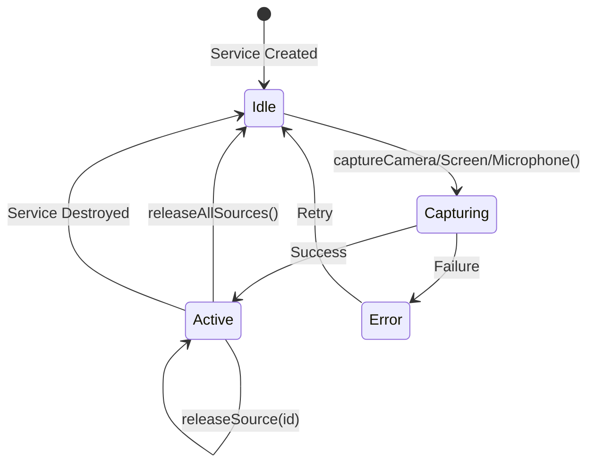

# Technical Specification: MediaCaptureService

**Feature ID:** Issue #2
**Version:** 1.0.0
**Status:** Implementation Ready
**Created:** 2025-11-14
**Author:** Angular Spec Architect
**Dependencies:** Issue #1 (TypeScript Type Definitions)

---

## 1. Feature Overview

### Purpose
Implement an Angular singleton service that manages browser media device capture (camera, microphone, screen sharing) using native browser APIs (getUserMedia, getDisplayMedia). This service provides reactive state management via Angular signals and handles device enumeration, constraint validation, error handling, and resource cleanup.

### User-Facing Value
- One-click camera/microphone/screen capture for streaming
- Automatic device detection and selection
- Graceful error handling with user-friendly messages
- Automatic resource cleanup prevents device lock-up
- Real-time device list updates when devices are connected/disconnected

### Key Functional Requirements
1. Capture webcam video with customizable constraints (resolution, frame rate, device ID)
2. Capture screen share with optional system audio
3. Capture microphone audio with noise suppression and echo cancellation
4. Enumerate available media devices (cameras, microphones)
5. Track active media sources reactively using signals
6. Stop individual or all media sources
7. Handle all getUserMedia error cases with recovery guidance
8. Validate HTTPS requirement before attempting capture
9. Clean up all resources on service destruction
10. Provide type-safe API using types from Issue #1

---

## 2. Research Summary

### Angular Signals Best Practices (2025)

**State Management with Signals:**
- Use `signal()` for mutable state that components will reactively consume
- Use `computed()` for derived state (e.g., "has active camera", "device count")
- Use `effect()` sparingly - only for side effects that must react to signals
- Expose read-only signals publicly via `.asReadonly()`
- Never mutate signal values - use `update()` or `set()`

**Service Patterns:**
- Use `providedIn: 'root'` for singleton services
- Use `inject()` function instead of constructor injection
- Use `DestroyRef` for cleanup logic
- Services can have signals just like components

### Browser Media APIs (getUserMedia)

**Native TypeScript Support:**
- `navigator.mediaDevices.getUserMedia()` returns `Promise<MediaStream>`
- `navigator.mediaDevices.getDisplayMedia()` returns `Promise<MediaStream>`
- `navigator.mediaDevices.enumerateDevices()` returns `Promise<MediaDeviceInfo[]>`
- All types available in `lib.dom.d.ts` (TypeScript 5.9.2)

**Error Handling:**
| Error Name | Cause | User Action |
|------------|-------|-------------|
| `NotAllowedError` | User denied permission | Grant camera/microphone permission |
| `NotFoundError` | No device found | Connect a camera/microphone |
| `NotReadableError` | Device in use | Close other apps using camera |
| `OverconstrainedError` | Constraints impossible | Use lower resolution/frame rate |
| `SecurityError` | Not HTTPS | Access via HTTPS or localhost |
| `AbortError` | User cancelled | Retry capture |

**HTTPS Requirement:**
- `getUserMedia` ONLY works in secure contexts (HTTPS or localhost)
- Check `window.isSecureContext` before calling API
- Fail fast with clear error message if not secure

**Resource Cleanup:**
- MUST call `track.stop()` on all MediaStreamTrack objects
- Tracks continue running even if MediaStream reference is lost
- Browser shows recording indicator until tracks are stopped
- Memory leaks possible if tracks not stopped

### Accessibility Considerations

**WCAG 2.2 Level AA Requirements:**
- Minimum 20 FPS for sign language interpretation (EN 301 549 Section 6)
- Support for audio descriptions and captions (future enhancement)
- Keyboard-accessible controls for starting/stopping capture
- Screen reader announcements for capture state changes

**Implementation Impact:**
- Default frame rate constraints should be >= 20 FPS
- Validate constraints before capture
- Provide accessible error messages

---

## 3. System Impact Analysis

### New Files Created
- `/src/app/core/services/media-capture.service.ts` - Main service implementation
- `/src/app/core/services/media-capture.service.spec.ts` - Unit tests

### Dependencies
**Required:**
- TypeScript type definitions from Issue #1:
  - `MediaSource`, `MediaSourceId`, `MediaSourceType`
  - `VideoConstraints`, `AudioConstraints`
  - `MediaCaptureError`, `MediaCaptureErrorType`
  - Type guards: `isMediaSourceType`, `validateMediaStreamConstraints`

**Angular:**
- `@angular/core` - `Injectable`, `signal`, `computed`, `effect`, `inject`, `DestroyRef`
- Native browser APIs - `navigator.mediaDevices`, `MediaStream`, `MediaStreamTrack`

### Consumers (Future Implementation)
- `VideoPreviewComponent` - Will display captured video streams
- `SceneCompositorService` - Will composite multiple media sources
- `WebRTCGatewayService` - Will send streams to media server
- `AudioMixerService` - Will mix audio from multiple sources

### Breaking Changes
None - this is new functionality.

### Migration Concerns
None - initial implementation.

---

## 4. Architecture Decisions

### Decision 1: Signal-Based State vs RxJS Observables

**Decision:** Use Angular signals for all reactive state, not RxJS BehaviorSubject/Observable.

**Rationale:**
- Signals are the recommended Angular 16+ pattern for reactive state
- Better performance than RxJS for simple state updates
- More ergonomic API (`activeStreams()` vs `activeStreams$.value`)
- Automatic change detection with OnPush strategy
- Aligns with project standards (CLAUDE.md: "Use signals for state management")

**Trade-offs:**
- Cannot use RxJS operators (map, filter, etc.) directly on signals
- Use `toObservable()` if RxJS interop needed later
- For this service, simple state updates don't need RxJS complexity

### Decision 2: Service-Level Cleanup vs Component-Level

**Decision:** Service handles cleanup in `DestroyRef.onDestroy()`, NOT relying on components.

**Rationale:**
- Service is singleton (`providedIn: 'root'`) - lives for app lifetime
- BUT: Must handle cleanup if service is destroyed in testing
- Tracks MUST be stopped when MediaSource is released
- Defense-in-depth: cleanup both when source released AND service destroyed

**Implementation:**
```typescript
constructor() {
  this.destroyRef.onDestroy(() => {
    // Stop all active streams
    this.cleanup();
  });
}
```

### Decision 3: Immediate vs Lazy Device Enumeration

**Decision:** Enumerate devices on-demand, not on service initialization.

**Rationale:**
- `enumerateDevices()` may return empty labels until permission granted
- Avoid unnecessary browser permission prompts on app load
- Call `enumerateDevices()` only when user opens device selector
- Re-enumerate after getUserMedia grants permission (labels become available)

### Decision 4: Error Handling Strategy

**Decision:** Transform DOMException to typed MediaCaptureError, throw Error objects.

**Rationale:**
- Type-safe error handling using MediaCaptureError interface
- Consistent error format across all methods
- Provides recovery guidance to consumers
- Separates error mapping logic from capture logic

**Implementation:**
```typescript
try {
  const stream = await navigator.mediaDevices.getUserMedia(constraints);
} catch (error) {
  if (error instanceof DOMException) {
    throw this.createMediaError(error, 'camera');
  }
  throw error;
}
```

### Decision 5: Constraint Validation Timing

**Decision:** Validate constraints BEFORE calling getUserMedia.

**Rationale:**
- Fail fast with clear validation error
- Avoid browser permission prompt for invalid constraints
- Prevent confusion when browser shows permission dialog then fails
- Use type guards from Issue #1 for validation

### Decision 6: Track-Ended Event Handling

**Decision:** Automatically remove MediaSource from state when track ends.

**Rationale:**
- User can stop screen share by clicking browser UI
- Track 'ended' event fires when user stops from browser
- Service state must reflect actual device state
- Prevents stale MediaSource references

**Implementation:**
```typescript
track.addEventListener('ended', () => {
  this.releaseSource(source.id);
});
```

---

## 5. API Design

### 5.1 Service Class Definition

```typescript
import { Injectable, signal, computed, inject, DestroyRef } from '@angular/core';
import type {
  MediaSource,
  MediaSourceId,
  MediaSourceType,
  VideoConstraints,
  AudioConstraints,
  MediaDeviceInfo,
  MediaCaptureError,
  MediaCaptureErrorType,
} from '../models';
import {
  validateMediaStreamConstraints,
  checkBrowserSupport,
} from '../guards/type-guards';

/**
 * Service for capturing and managing media sources from browser devices.
 *
 * Provides reactive state management via signals for:
 * - Active media streams (camera, microphone, screen share)
 * - Available media devices
 * - Capture errors
 *
 * Features:
 * - Type-safe API using strict TypeScript
 * - Automatic resource cleanup
 * - HTTPS validation
 * - Comprehensive error handling
 * - Device enumeration with permission handling
 *
 * @example
 * ```typescript
 * const mediaCaptureService = inject(MediaCaptureService);
 *
 * // Capture camera
 * const cameraSource = await mediaCaptureService.captureCamera({
 *   width: 1920,
 *   height: 1080,
 *   frameRate: 30,
 * });
 *
 * // Access stream
 * const stream = cameraSource.stream;
 *
 * // Track all active sources reactively
 * const activeSources = mediaCaptureService.activeStreams();
 *
 * // Release when done
 * mediaCaptureService.releaseSource(cameraSource.id);
 * ```
 */
@Injectable({
  providedIn: 'root',
})
export class MediaCaptureService {
  private readonly destroyRef = inject(DestroyRef);

  // Private writable signal
  private readonly sourcesSignal = signal<readonly MediaSource[]>([]);

  // Public read-only signals
  readonly activeStreams = this.sourcesSignal.asReadonly();

  // Computed signals
  readonly hasActiveCamera = computed(() =>
    this.sourcesSignal().some((s) => s.type === 'camera')
  );

  readonly hasActiveScreen = computed(() =>
    this.sourcesSignal().some((s) => s.type === 'screen')
  );

  readonly hasActiveMicrophone = computed(() =>
    this.sourcesSignal().some((s) => s.type === 'audio')
  );

  readonly activeCameraSources = computed(() =>
    this.sourcesSignal().filter((s) => s.type === 'camera')
  );

  readonly activeScreenSources = computed(() =>
    this.sourcesSignal().filter((s) => s.type === 'screen')
  );

  readonly activeAudioSources = computed(() =>
    this.sourcesSignal().filter((s) => s.type === 'audio')
  );

  constructor() {
    // Verify browser support on initialization
    this.checkBrowserCapabilities();

    // Cleanup all streams on service destruction
    this.destroyRef.onDestroy(() => {
      this.cleanup();
    });
  }

  /**
   * Capture camera feed with specified constraints.
   *
   * @param constraints - Video capture constraints (resolution, frame rate, device)
   * @returns Promise resolving to MediaSource containing the camera stream
   * @throws MediaCaptureError if capture fails
   *
   * @example
   * ```typescript
   * const camera = await service.captureCamera({
   *   width: 1920,
   *   height: 1080,
   *   frameRate: 30,
   *   facingMode: 'user',
   * });
   * ```
   */
  async captureCamera(constraints: VideoConstraints): Promise<MediaSource>;

  /**
   * Capture screen share with optional system audio.
   *
   * @param options - Screen capture options
   * @returns Promise resolving to MediaSource containing the screen stream
   * @throws MediaCaptureError if capture fails
   *
   * @example
   * ```typescript
   * const screen = await service.captureScreen({
   *   includeAudio: true,
   *   preferCurrentTab: false,
   * });
   * ```
   */
  async captureScreen(options: ScreenCaptureOptions): Promise<MediaSource>;

  /**
   * Capture microphone audio with specified constraints.
   *
   * @param constraints - Audio capture constraints
   * @returns Promise resolving to MediaSource containing the audio stream
   * @throws MediaCaptureError if capture fails
   *
   * @example
   * ```typescript
   * const microphone = await service.captureMicrophone({
   *   echoCancellation: true,
   *   noiseSuppression: true,
   *   autoGainControl: true,
   * });
   * ```
   */
  async captureMicrophone(constraints: AudioConstraints): Promise<MediaSource>;

  /**
   * Enumerate available media devices.
   *
   * Note: Device labels may be empty until getUserMedia permission is granted.
   * Call this method again after successful capture to get full labels.
   *
   * @returns Promise resolving to array of available devices
   *
   * @example
   * ```typescript
   * const devices = await service.enumerateDevices();
   * const cameras = devices.filter(d => d.kind === 'videoinput');
   * ```
   */
  async enumerateDevices(): Promise<readonly MediaDeviceInfo[]>;

  /**
   * Release a media source and stop its tracks.
   *
   * @param sourceId - ID of source to release
   *
   * @example
   * ```typescript
   * service.releaseSource(cameraSource.id);
   * ```
   */
  releaseSource(sourceId: MediaSourceId): void;

  /**
   * Release all active media sources.
   *
   * @example
   * ```typescript
   * service.releaseAllSources();
   * ```
   */
  releaseAllSources(): void;

  /**
   * Get a specific media source by ID.
   *
   * @param sourceId - Source ID to find
   * @returns MediaSource if found, undefined otherwise
   */
  getSource(sourceId: MediaSourceId): MediaSource | undefined;

  /**
   * Check if a specific device is currently in use.
   *
   * @param deviceId - Device ID to check
   * @returns true if device is currently captured
   */
  isDeviceActive(deviceId: string): boolean;
}

/**
 * Options for screen capture
 */
export interface ScreenCaptureOptions {
  /**
   * Include system audio in screen capture
   */
  readonly includeAudio: boolean;

  /**
   * Prefer current browser tab (if browser supports)
   */
  readonly preferCurrentTab?: boolean;

  /**
   * Preferred display surface (window, monitor, browser)
   */
  readonly displaySurface?: 'monitor' | 'window' | 'browser';
}
```

### 5.2 Method Signatures with Return Types

```typescript
// All method signatures with complete type information

captureCamera(constraints: VideoConstraints): Promise<MediaSource>

captureScreen(options: ScreenCaptureOptions): Promise<MediaSource>

captureMicrophone(constraints: AudioConstraints): Promise<MediaSource>

enumerateDevices(): Promise<readonly MediaDeviceInfo[]>

releaseSource(sourceId: MediaSourceId): void

releaseAllSources(): void

getSource(sourceId: MediaSourceId): MediaSource | undefined

isDeviceActive(deviceId: string): boolean

// Private methods (not part of public API)
private checkBrowserCapabilities(): void
private checkSecureContext(): void
private validateConstraints(constraints: MediaStreamConstraints): void
private captureMediaSource(
  type: MediaSourceType,
  constraints: MediaStreamConstraints,
  useDisplayMedia: boolean
): Promise<MediaSource>
private buildVideoConstraints(constraints: VideoConstraints): MediaTrackConstraints
private buildAudioConstraints(constraints: AudioConstraints): MediaTrackConstraints
private addSource(source: MediaSource): void
private removeSource(sourceId: MediaSourceId): void
private stopMediaStream(stream: MediaStream): void
private setupTrackEndedListener(source: MediaSource): void
private createMediaError(error: DOMException, sourceType: MediaSourceType): Error
private generateSourceId(): MediaSourceId
private getStreamLabel(stream: MediaStream, defaultLabel: string): string
private cleanup(): void
```

---

## 6. State Management

### 6.1 Signal Definitions

```typescript
// Private writable signal (internal use only)
private readonly sourcesSignal = signal<readonly MediaSource[]>([]);

// Public read-only signal (exposed to consumers)
readonly activeStreams = this.sourcesSignal.asReadonly();
```

**State Shape:**
```typescript
[
  {
    id: 'media-source-abc123',
    type: 'camera',
    stream: MediaStream { id: '...', active: true },
    constraints: { video: { ... } },
    label: 'HD Webcam (0408:1234)',
    capturedAt: Date('2025-11-14T10:30:00Z'),
  },
  {
    id: 'media-source-def456',
    type: 'screen',
    stream: MediaStream { id: '...', active: true },
    constraints: { video: true, audio: true },
    label: 'Screen Share',
    capturedAt: Date('2025-11-14T10:31:00Z'),
  },
]
```

### 6.2 Computed Signal Derivations

```typescript
// Derived boolean states
readonly hasActiveCamera = computed(() =>
  this.sourcesSignal().some((s) => s.type === 'camera')
);

readonly hasActiveScreen = computed(() =>
  this.sourcesSignal().some((s) => s.type === 'screen')
);

readonly hasActiveMicrophone = computed(() =>
  this.sourcesSignal().some((s) => s.type === 'audio')
);

// Filtered lists
readonly activeCameraSources = computed(() =>
  this.sourcesSignal().filter((s) => s.type === 'camera')
);

readonly activeScreenSources = computed(() =>
  this.sourcesSignal().filter((s) => s.type === 'screen')
);

readonly activeAudioSources = computed(() =>
  this.sourcesSignal().filter((s) => s.type === 'audio')
);

// Computed counts
readonly activeCameraCount = computed(() =>
  this.activeCameraSources().length
);

readonly totalActiveSourceCount = computed(() =>
  this.sourcesSignal().length
);
```

### 6.3 State Transitions



**State Update Flow:**
1. User calls `captureCamera(constraints)`
2. Validate constraints
3. Call `navigator.mediaDevices.getUserMedia()`
4. Create `MediaSource` object
5. Call `addSource(mediaSource)`
6. Signal updates: `sourcesSignal.update(sources => [...sources, mediaSource])`
7. All computed signals automatically update
8. Components using `activeStreams()` re-render

**Cleanup Flow:**
1. User calls `releaseSource(sourceId)`
2. Find source in state
3. Call `stopMediaStream(source.stream)`
4. For each track: `track.stop()`
5. Remove from state: `sourcesSignal.update(sources => sources.filter(...))`
6. Computed signals update
7. Components re-render

---

## 7. Error Handling

### 7.1 Error Types and Recovery

```typescript
/**
 * Create typed error from DOMException
 */
private createMediaError(
  error: DOMException,
  sourceType: MediaSourceType
): Error {
  const errorType = error.name as MediaCaptureErrorType;

  const errorMessages: Record<MediaCaptureErrorType, {
    message: string;
    recoverable: boolean;
    suggestedAction: string;
  }> = {
    NotAllowedError: {
      message: `${sourceType} permission denied by user`,
      recoverable: true,
      suggestedAction: 'Grant permission in browser settings and retry',
    },
    NotFoundError: {
      message: `No ${sourceType} device found`,
      recoverable: true,
      suggestedAction: 'Connect a device and retry',
    },
    NotReadableError: {
      message: `${sourceType} device is already in use`,
      recoverable: true,
      suggestedAction: 'Close other applications using the device',
    },
    OverconstrainedError: {
      message: `${sourceType} constraints cannot be satisfied`,
      recoverable: true,
      suggestedAction: 'Try lower resolution or frame rate',
    },
    SecurityError: {
      message: `${sourceType} access blocked - HTTPS required`,
      recoverable: false,
      suggestedAction: 'Access application via HTTPS or localhost',
    },
    AbortError: {
      message: `${sourceType} capture was cancelled`,
      recoverable: true,
      suggestedAction: 'Retry capture',
    },
    TypeError: {
      message: `Invalid ${sourceType} constraints`,
      recoverable: true,
      suggestedAction: 'Check constraint values',
    },
    UnknownError: {
      message: `Unknown error capturing ${sourceType}`,
      recoverable: true,
      suggestedAction: 'Retry or refresh page',
    },
  };

  const errorInfo = errorMessages[errorType] || errorMessages.UnknownError;

  const captureError = new Error(errorInfo.message);
  (captureError as any).type = errorType;
  (captureError as any).recoverable = errorInfo.recoverable;
  (captureError as any).suggestedAction = errorInfo.suggestedAction;
  (captureError as any).originalError = error;

  return captureError;
}
```

### 7.2 HTTPS Validation

```typescript
/**
 * Check if running in secure context (HTTPS or localhost)
 * Throws error if not secure
 */
private checkSecureContext(): void {
  if (!window.isSecureContext) {
    throw new Error(
      'Media capture requires a secure context (HTTPS). ' +
      'Please access the application via https:// or localhost'
    );
  }
}
```

### 7.3 Constraint Validation

```typescript
/**
 * Validate media stream constraints before capture
 */
private validateConstraints(constraints: MediaStreamConstraints): void {
  const result = validateMediaStreamConstraints(constraints);

  if (!result.valid) {
    throw new Error(
      `Invalid media constraints: ${result.errors.join(', ')}`
    );
  }
}
```

---

## 8. Testing Strategy

### 8.1 Unit Test Structure

```typescript
// /src/app/core/services/media-capture.service.spec.ts

import { TestBed } from '@angular/core/testing';
import { MediaCaptureService } from './media-capture.service';
import type { VideoConstraints, AudioConstraints } from '../models';

/**
 * Mock MediaStream for testing
 */
class MockMediaStream implements Partial<MediaStream> {
  id = 'mock-stream-' + Math.random();
  active = true;
  private tracks: MediaStreamTrack[] = [];

  getTracks(): MediaStreamTrack[] {
    return [...this.tracks];
  }

  getVideoTracks(): MediaStreamTrack[] {
    return this.tracks.filter((t) => t.kind === 'video');
  }

  getAudioTracks(): MediaStreamTrack[] {
    return this.tracks.filter((t) => t.kind === 'audio');
  }

  addTrack(track: MediaStreamTrack): void {
    this.tracks.push(track);
  }
}

/**
 * Mock MediaStreamTrack
 */
class MockMediaStreamTrack implements Partial<MediaStreamTrack> {
  id = 'mock-track-' + Math.random();
  kind: 'audio' | 'video';
  label = 'Mock Track';
  enabled = true;
  readyState: MediaStreamTrackState = 'live';

  private eventListeners = new Map<string, EventListener[]>();

  constructor(kind: 'audio' | 'video') {
    this.kind = kind;
  }

  stop(): void {
    this.readyState = 'ended';
    this.dispatchEvent(new Event('ended'));
  }

  addEventListener(type: string, listener: EventListener): void {
    if (!this.eventListeners.has(type)) {
      this.eventListeners.set(type, []);
    }
    this.eventListeners.get(type)!.push(listener);
  }

  dispatchEvent(event: Event): boolean {
    const listeners = this.eventListeners.get(event.type) || [];
    listeners.forEach((listener) => listener(event));
    return true;
  }
}

describe('MediaCaptureService', () => {
  let service: MediaCaptureService;
  let getUserMediaSpy: jasmine.Spy;
  let getDisplayMediaSpy: jasmine.Spy;
  let enumerateDevicesSpy: jasmine.Spy;

  beforeEach(() => {
    TestBed.configureTestingModule({});
    service = TestBed.inject(MediaCaptureService);

    // Reset spies
    if (getUserMediaSpy) {
      getUserMediaSpy.calls.reset();
    }
    if (getDisplayMediaSpy) {
      getDisplayMediaSpy.calls.reset();
    }
  });

  describe('initialization', () => {
    it('should be created', () => {
      expect(service).toBeTruthy();
    });

    it('should have empty active streams initially', () => {
      expect(service.activeStreams()).toEqual([]);
    });

    it('should have all computed signals as false initially', () => {
      expect(service.hasActiveCamera()).toBe(false);
      expect(service.hasActiveScreen()).toBe(false);
      expect(service.hasActiveMicrophone()).toBe(false);
    });
  });

  describe('captureCamera', () => {
    it('should capture camera with correct constraints', async () => {
      // Arrange
      const mockStream = new MockMediaStream() as unknown as MediaStream;
      const mockTrack = new MockMediaStreamTrack('video') as unknown as MediaStreamTrack;
      mockStream.addTrack(mockTrack);

      getUserMediaSpy = spyOn(navigator.mediaDevices, 'getUserMedia')
        .and.returnValue(Promise.resolve(mockStream));

      const constraints: VideoConstraints = {
        width: 1920,
        height: 1080,
        frameRate: 30,
      };

      // Act
      const source = await service.captureCamera(constraints);

      // Assert
      expect(getUserMediaSpy).toHaveBeenCalledWith({
        video: {
          width: { ideal: 1920 },
          height: { ideal: 1080 },
          frameRate: { ideal: 30 },
        },
        audio: false,
      });
      expect(source.type).toBe('camera');
      expect(source.stream).toBe(mockStream);
      expect(service.activeStreams().length).toBe(1);
      expect(service.hasActiveCamera()).toBe(true);
    });

    it('should handle NotAllowedError', async () => {
      // Arrange
      const error = new DOMException('Permission denied', 'NotAllowedError');
      getUserMediaSpy = spyOn(navigator.mediaDevices, 'getUserMedia')
        .and.returnValue(Promise.reject(error));

      const constraints: VideoConstraints = {
        width: 1920,
        height: 1080,
        frameRate: 30,
      };

      // Act & Assert
      await expectAsync(service.captureCamera(constraints))
        .toBeRejectedWithError('camera permission denied by user');
    });

    it('should handle NotFoundError', async () => {
      // Arrange
      const error = new DOMException('No device found', 'NotFoundError');
      getUserMediaSpy = spyOn(navigator.mediaDevices, 'getUserMedia')
        .and.returnValue(Promise.reject(error));

      const constraints: VideoConstraints = {
        width: 1920,
        height: 1080,
        frameRate: 30,
      };

      // Act & Assert
      await expectAsync(service.captureCamera(constraints))
        .toBeRejectedWithError('No camera device found');
    });

    it('should validate low frame rate', async () => {
      // Arrange
      const constraints: VideoConstraints = {
        width: 1920,
        height: 1080,
        frameRate: 15, // Below 20 FPS minimum
      };

      // Act & Assert
      await expectAsync(service.captureCamera(constraints))
        .toBeRejectedWithError(/Frame rate should be at least 20 FPS/);
    });
  });

  describe('captureScreen', () => {
    it('should capture screen with audio', async () => {
      // Arrange
      const mockStream = new MockMediaStream() as unknown as MediaStream;
      const mockVideoTrack = new MockMediaStreamTrack('video') as unknown as MediaStreamTrack;
      const mockAudioTrack = new MockMediaStreamTrack('audio') as unknown as MediaStreamTrack;
      mockStream.addTrack(mockVideoTrack);
      mockStream.addTrack(mockAudioTrack);

      getDisplayMediaSpy = spyOn(navigator.mediaDevices, 'getDisplayMedia')
        .and.returnValue(Promise.resolve(mockStream));

      // Act
      const source = await service.captureScreen({ includeAudio: true });

      // Assert
      expect(getDisplayMediaSpy).toHaveBeenCalledWith({
        video: {
          width: { ideal: 1920 },
          height: { ideal: 1080 },
          frameRate: { ideal: 30 },
        },
        audio: true,
      });
      expect(source.type).toBe('screen');
      expect(service.hasActiveScreen()).toBe(true);
    });

    it('should handle user cancellation', async () => {
      // Arrange
      const error = new DOMException('User cancelled', 'AbortError');
      getDisplayMediaSpy = spyOn(navigator.mediaDevices, 'getDisplayMedia')
        .and.returnValue(Promise.reject(error));

      // Act & Assert
      await expectAsync(service.captureScreen({ includeAudio: false }))
        .toBeRejectedWithError('screen capture was cancelled');
    });
  });

  describe('captureMicrophone', () => {
    it('should capture microphone with noise suppression', async () => {
      // Arrange
      const mockStream = new MockMediaStream() as unknown as MediaStream;
      const mockTrack = new MockMediaStreamTrack('audio') as unknown as MediaStreamTrack;
      mockStream.addTrack(mockTrack);

      getUserMediaSpy = spyOn(navigator.mediaDevices, 'getUserMedia')
        .and.returnValue(Promise.resolve(mockStream));

      const constraints: AudioConstraints = {
        echoCancellation: true,
        noiseSuppression: true,
        autoGainControl: true,
      };

      // Act
      const source = await service.captureMicrophone(constraints);

      // Assert
      expect(getUserMediaSpy).toHaveBeenCalledWith({
        video: false,
        audio: {
          echoCancellation: true,
          noiseSuppression: true,
          autoGainControl: true,
        },
      });
      expect(source.type).toBe('audio');
      expect(service.hasActiveMicrophone()).toBe(true);
    });
  });

  describe('enumerateDevices', () => {
    it('should return available devices', async () => {
      // Arrange
      const mockDevices: MediaDeviceInfo[] = [
        {
          deviceId: 'camera-1',
          kind: 'videoinput',
          label: 'HD Webcam',
          groupId: 'group-1',
          toJSON: () => ({}),
        } as MediaDeviceInfo,
        {
          deviceId: 'mic-1',
          kind: 'audioinput',
          label: 'Built-in Microphone',
          groupId: 'group-2',
          toJSON: () => ({}),
        } as MediaDeviceInfo,
      ];

      enumerateDevicesSpy = spyOn(navigator.mediaDevices, 'enumerateDevices')
        .and.returnValue(Promise.resolve(mockDevices));

      // Act
      const devices = await service.enumerateDevices();

      // Assert
      expect(devices.length).toBe(2);
      expect(devices[0].kind).toBe('videoinput');
      expect(devices[1].kind).toBe('audioinput');
    });
  });

  describe('releaseSource', () => {
    it('should stop track and remove from state', async () => {
      // Arrange
      const mockStream = new MockMediaStream() as unknown as MediaStream;
      const mockTrack = new MockMediaStreamTrack('video') as unknown as MediaStreamTrack;
      mockStream.addTrack(mockTrack);

      getUserMediaSpy = spyOn(navigator.mediaDevices, 'getUserMedia')
        .and.returnValue(Promise.resolve(mockStream));

      const source = await service.captureCamera({
        width: 1920,
        height: 1080,
        frameRate: 30,
      });

      const stopSpy = spyOn(mockTrack, 'stop');

      // Act
      service.releaseSource(source.id);

      // Assert
      expect(stopSpy).toHaveBeenCalled();
      expect(service.activeStreams().length).toBe(0);
      expect(service.hasActiveCamera()).toBe(false);
    });
  });

  describe('track ended event', () => {
    it('should remove source when track ends', async () => {
      // Arrange
      const mockStream = new MockMediaStream() as unknown as MediaStream;
      const mockTrack = new MockMediaStreamTrack('video') as unknown as MediaStreamTrack;
      mockStream.addTrack(mockTrack);

      getUserMediaSpy = spyOn(navigator.mediaDevices, 'getUserMedia')
        .and.returnValue(Promise.resolve(mockStream));

      await service.captureCamera({
        width: 1920,
        height: 1080,
        frameRate: 30,
      });

      expect(service.activeStreams().length).toBe(1);

      // Act - simulate user stopping screen share from browser UI
      mockTrack.stop();

      // Assert - source should be automatically removed
      expect(service.activeStreams().length).toBe(0);
    });
  });

  describe('computed signals', () => {
    it('should update activeCameraSources', async () => {
      // Arrange
      const mockStream = new MockMediaStream() as unknown as MediaStream;
      const mockTrack = new MockMediaStreamTrack('video') as unknown as MediaStreamTrack;
      mockStream.addTrack(mockTrack);

      getUserMediaSpy = spyOn(navigator.mediaDevices, 'getUserMedia')
        .and.returnValue(Promise.resolve(mockStream));

      expect(service.activeCameraSources().length).toBe(0);

      // Act
      await service.captureCamera({
        width: 1920,
        height: 1080,
        frameRate: 30,
      });

      // Assert
      expect(service.activeCameraSources().length).toBe(1);
      expect(service.activeCameraSources()[0].type).toBe('camera');
    });
  });

  describe('cleanup', () => {
    it('should stop all tracks on service destroy', async () => {
      // Arrange
      const mockStream1 = new MockMediaStream() as unknown as MediaStream;
      const mockTrack1 = new MockMediaStreamTrack('video') as unknown as MediaStreamTrack;
      mockStream1.addTrack(mockTrack1);

      const mockStream2 = new MockMediaStream() as unknown as MediaStream;
      const mockTrack2 = new MockMediaStreamTrack('audio') as unknown as MediaStreamTrack;
      mockStream2.addTrack(mockTrack2);

      getUserMediaSpy = spyOn(navigator.mediaDevices, 'getUserMedia')
        .and.returnValues(
          Promise.resolve(mockStream1),
          Promise.resolve(mockStream2)
        );

      await service.captureCamera({ width: 1920, height: 1080, frameRate: 30 });
      await service.captureMicrophone({
        echoCancellation: true,
        noiseSuppression: true,
        autoGainControl: true,
      });

      const stopSpy1 = spyOn(mockTrack1, 'stop');
      const stopSpy2 = spyOn(mockTrack2, 'stop');

      // Act - destroy service
      TestBed.resetTestingModule();

      // Assert
      expect(stopSpy1).toHaveBeenCalled();
      expect(stopSpy2).toHaveBeenCalled();
    });
  });
});
```

### 8.2 Test Coverage Requirements

**Minimum Coverage:** 90%

**Critical Test Cases:**
- [ ] Camera capture with valid constraints
- [ ] Screen capture with and without audio
- [ ] Microphone capture with all audio constraints
- [ ] All error types (NotAllowedError, NotFoundError, etc.)
- [ ] Constraint validation (low frame rate, low resolution)
- [ ] HTTPS validation (mock window.isSecureContext = false)
- [ ] Device enumeration
- [ ] Source release (stop tracks)
- [ ] Automatic removal on track 'ended' event
- [ ] Cleanup on service destruction
- [ ] All computed signals update correctly
- [ ] Multiple simultaneous captures

---

## 9. Integration Points

### 9.1 VideoPreviewComponent (Future)

```typescript
// Example consumer component

import { Component, inject, effect } from '@angular/core';
import { MediaCaptureService } from '@core/services';

@Component({
  selector: 'app-video-preview',
  template: `
    <video #videoElement autoplay playsinline></video>

    @if (error()) {
      <div class="error">{{ error() }}</div>
    }
  `,
  changeDetection: ChangeDetectionStrategy.OnPush,
})
export class VideoPreviewComponent {
  private readonly mediaCaptureService = inject(MediaCaptureService);
  private readonly videoElement = viewChild.required<ElementRef<HTMLVideoElement>>('videoElement');

  protected readonly error = signal<string | null>(null);

  constructor() {
    effect(() => {
      const cameras = this.mediaCaptureService.activeCameraSources();

      if (cameras.length > 0) {
        // Display first camera stream
        const videoEl = this.videoElement().nativeElement;
        videoEl.srcObject = cameras[0].stream;
      }
    });
  }

  async startCamera(): Promise<void> {
    try {
      await this.mediaCaptureService.captureCamera({
        width: 1920,
        height: 1080,
        frameRate: 30,
      });
      this.error.set(null);
    } catch (err) {
      this.error.set((err as Error).message);
    }
  }
}
```

### 9.2 WebRTCGatewayService (Future)

```typescript
// Example consumer service

import { Injectable, inject } from '@angular/core';
import { MediaCaptureService } from './media-capture.service';
import type { MediaSource } from '@core/models';

@Injectable({
  providedIn: 'root',
})
export class WebRTCGatewayService {
  private readonly mediaCaptureService = inject(MediaCaptureService);

  async startStreaming(): Promise<void> {
    const cameras = this.mediaCaptureService.activeCameraSources();
    const microphones = this.mediaCaptureService.activeAudioSources();

    if (cameras.length === 0 || microphones.length === 0) {
      throw new Error('Camera and microphone required for streaming');
    }

    const videoTrack = cameras[0].stream.getVideoTracks()[0];
    const audioTrack = microphones[0].stream.getAudioTracks()[0];

    // Add tracks to RTCPeerConnection
    this.peerConnection.addTrack(videoTrack, cameras[0].stream);
    this.peerConnection.addTrack(audioTrack, microphones[0].stream);
  }
}
```

### 9.3 SceneCompositorService (Future)

```typescript
// Example consumer service

import { Injectable, inject, signal } from '@angular/core';
import { MediaCaptureService } from './media-capture.service';

@Injectable({
  providedIn: 'root',
})
export class SceneCompositorService {
  private readonly mediaCaptureService = inject(MediaCaptureService);
  private canvas!: OffscreenCanvas;
  private ctx!: OffscreenCanvasRenderingContext2D;

  compositeScene(): void {
    const cameras = this.mediaCaptureService.activeCameraSources();
    const screens = this.mediaCaptureService.activeScreenSources();

    // Draw camera in corner
    if (cameras.length > 0) {
      const video = document.createElement('video');
      video.srcObject = cameras[0].stream;
      this.ctx.drawImage(video, 0, 0, 320, 240);
    }

    // Draw screen as main source
    if (screens.length > 0) {
      const video = document.createElement('video');
      video.srcObject = screens[0].stream;
      this.ctx.drawImage(video, 0, 0, 1920, 1080);
    }
  }
}
```

---

## 10. Implementation Checklist

### Phase 1: Core Service Structure
- [ ] Create `/src/app/core/services/media-capture.service.ts`
- [ ] Create `/src/app/core/services/media-capture.service.spec.ts`
- [ ] Implement service class with signals
- [ ] Implement `DestroyRef` cleanup logic
- [ ] Write tests for service initialization

### Phase 2: Camera Capture
- [ ] Implement `captureCamera(constraints)`
- [ ] Implement `buildVideoConstraints()` helper
- [ ] Implement constraint validation
- [ ] Handle all getUserMedia errors
- [ ] Write tests for camera capture (happy path + errors)

### Phase 3: Screen & Microphone Capture
- [ ] Implement `captureScreen(options)`
- [ ] Implement `captureMicrophone(constraints)`
- [ ] Implement `buildAudioConstraints()` helper
- [ ] Write tests for screen and microphone capture

### Phase 4: Device Enumeration
- [ ] Implement `enumerateDevices()`
- [ ] Handle permission-gated labels
- [ ] Write tests for device enumeration

### Phase 5: Source Management
- [ ] Implement `releaseSource(id)`
- [ ] Implement `releaseAllSources()`
- [ ] Implement `getSource(id)`
- [ ] Implement `isDeviceActive(deviceId)`
- [ ] Implement track 'ended' event listener
- [ ] Write tests for source lifecycle

### Phase 6: Computed Signals
- [ ] Implement all computed signals
- [ ] Test computed signals update correctly
- [ ] Verify OnPush change detection works

### Phase 7: Error Handling & Validation
- [ ] Implement `checkSecureContext()`
- [ ] Implement `checkBrowserCapabilities()`
- [ ] Implement `createMediaError()`
- [ ] Implement `validateConstraints()`
- [ ] Write tests for all error cases

### Phase 8: Cleanup & Edge Cases
- [ ] Implement `cleanup()` method
- [ ] Test cleanup on service destroy
- [ ] Test multiple simultaneous captures
- [ ] Test edge cases (invalid IDs, double release)

### Phase 9: Documentation
- [ ] Add JSDoc comments to all public methods
- [ ] Document error types and recovery
- [ ] Create usage examples
- [ ] Document HTTPS requirement

### Phase 10: Final Validation
- [ ] Run all tests (100% passing)
- [ ] Check test coverage (>90%)
- [ ] Verify TypeScript strict mode compliance
- [ ] Manual testing in browser
- [ ] Test on different browsers (Chrome, Firefox, Safari)

---

## 11. Success Criteria

Service is complete when:

- [ ] All public methods implemented
- [ ] All unit tests passing
- [ ] Test coverage >90%
- [ ] No TypeScript errors in strict mode
- [ ] No `any` types used
- [ ] All signals reactive and read-only exposed
- [ ] Cleanup logic prevents memory leaks
- [ ] HTTPS validation works
- [ ] All error cases handled with user-friendly messages
- [ ] Constraint validation prevents invalid getUserMedia calls
- [ ] Track 'ended' events remove sources from state
- [ ] Works in Chrome, Firefox, Safari (latest versions)
- [ ] JSDoc comments on all public methods
- [ ] Integration examples documented

---

## 12. References

### Browser APIs
- [MDN: getUserMedia()](https://developer.mozilla.org/en-US/docs/Web/API/MediaDevices/getUserMedia)
- [MDN: getDisplayMedia()](https://developer.mozilla.org/en-US/docs/Web/API/MediaDevices/getDisplayMedia)
- [MDN: enumerateDevices()](https://developer.mozilla.org/en-US/docs/Web/API/MediaDevices/enumerateDevices)
- [MDN: MediaStream](https://developer.mozilla.org/en-US/docs/Web/API/MediaStream)
- [MDN: MediaStreamTrack](https://developer.mozilla.org/en-US/docs/Web/API/MediaStreamTrack)
- [W3C: Media Capture and Streams](https://w3c.github.io/mediacapture-main/)

### Angular Documentation
- [Angular: Signals](https://angular.dev/guide/signals)
- [Angular: Dependency Injection with inject()](https://angular.dev/guide/di)
- [Angular: DestroyRef](https://angular.dev/api/core/DestroyRef)
- [Angular: Testing Services](https://angular.dev/guide/testing/services)

### Project Files
- [TypeScript Type Definitions Spec](file:///home/matthias/projects/stream-buddy/docs/specs/001-typescript-types.spec.md)
- [STREAMING_IMPLEMENTATION_PLAYBOOK.md](file:///home/matthias/projects/stream-buddy/STREAMING_IMPLEMENTATION_PLAYBOOK.md) (lines 847-1003)
- [CLAUDE.md](file:///home/matthias/projects/stream-buddy/.claude/CLAUDE.md)

---

**End of Specification**

This specification is implementation-ready. A TDD developer can implement MediaCaptureService by following the test-driven approach: write tests first (using the test examples provided), then implement methods to make tests pass. All architectural decisions have been made - no design choices remain.
